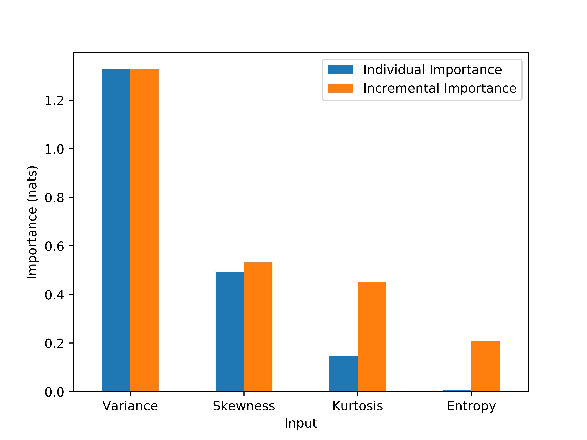
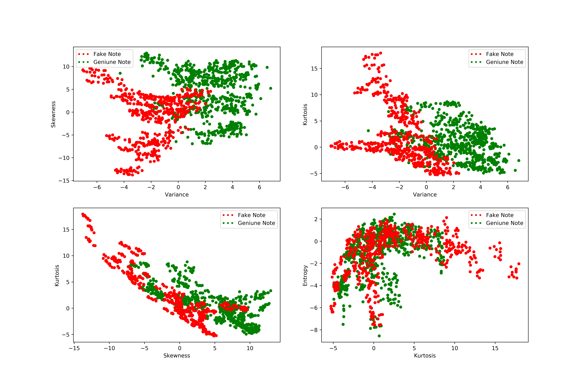

===============
Getting Started
===============

The **KXY platform** is the `only AutoML platform` dedicated to bringing about **business value** by addressing two classes of questions 
that are fundamental to the data science life cycle in a rigorous, fast, and cost-effective manner:

* **Pre-Learning Questions**: How valuable is a dataset for improving decision making, in an absolute sense and relative to others?
* **Post-Learning Questions**: How do you explain what your trained model is doing, including ensuring it is not biased? Which action would yield a higher ROI, trying to improve your trained model using the same datasets, or investing in acquiring additional and complementary datasets?

Installation
------------

The KXY python package can be installed from PyPi by running

.. code-block:: bash
	
	pip install kxy

The package only supports python 3.

Authentication
--------------

All heavy-duty operations, including but not limited to solving any **maximum-entropy optimization problem**, are run on the KXY infrastructure and require an API key. The API key should be set in the environment variable ``KXY_API_KEY``. 

This can be done in MacOS or Linux terminals by running 

.. code-block:: bash
	
	export KXY_API_KEY='YOUR API KEY GOES HERE'

or from within your python program by running 

.. code-block:: python

	>>> import os
	>>> os.environ['KXY_API_KEY'] = 'YOUR API KEY GOES HERE'

Examples
--------

Loading Data
^^^^^^^^^^^^

.. code-block:: python

	>>> import pandas as pd
	>>> import kxy # This import is critical to enable our method in all pandas DataFrame instances
	>>> # Bank note UCI dataset (binary classification)
	>>> url = 'http://archive.ics.uci.edu/ml/machine-learning-databases/00267/'\
	... 	'data_banknote_authentication.txt'
	>>> df = pd.read_csv(url, names=['Variance', 'Skewness', 'Kurtosis', 'Entropy', 'Is Fake'])

Classification
^^^^^^^^^^^^^^

Pre-Learning: Feasibility
"""""""""""""""""""""""""
To what extent can we predict whether the bank note is fake from an image using provided 
inputs (irrespective of the classification model)?

.. code-block:: python

	>>> df.kxy.classification_feasibility('Is Fake')
	3.58

The higher the number is relative to the entropy of the responsee, the better. A value of 0
means no model can successfully solve this classification problem using provided inputs, no
matter how complex, no matter how deep. In such as case, resources should be allocated to 
looking for more relevant dataset to use as inputs, rather than increasing model complexity.

.. code-block:: python

	>>> kxy.discrete_entropy(df['Is Fake'].values)
	0.69

Pre-Learning: Input Importance
""""""""""""""""""""""""""""""
Once we know the problem is feasible using inputs at hand, the next question before we jump
into modeling is what are the inputs that are the most useful for solving this problem. Once
more, this question is asked and answered independently from any classification model (hence the expression **pre-learning**),
and reduces time wasted improving models fitted on irrelevant inputs.

.. code-block:: python

	>>> importance_df_1 = df.kxy.individual_input_importance('Is Fake')
	>>> importance_df_1
	       input  individual_importance  normalized_individual_importance  cum_normalized_individual_importance
	0  Variance                   1.89                              0.84                                  0.84
	1  Skewness                   0.37                              0.16                                  1.00
	2  Kurtosis                   0.00                              0.00                                  1.00
	3   Entropy                   0.00                              0.00                                  1.00
	>>> importance_df_2 = df.kxy.incremental_input_importance('Is Fake')
	>>> importance_df_2
	       input  selection_order  incremental_importance  normalized_incremental_importance  cum_normalized_incremental_importance
	0  Variance                1                    1.89                               0.71                                   0.71
	1  Skewness                2                    0.32                               0.12                                   0.83
	2  Kurtosis                3                    0.44                               0.17                                   1.00
	3   Entropy                4                    0.00                               0.00                                   1.00
	>>> importance_df_1 = importance_df_1.set_index(['input'])
	>>> importance_df_2 = importance_df_2.set_index(['input'])
	>>> importance_df = pd.concat([importance_df_1, importance_df_2], axis=1)
	>>> importance_df.reset_index(inplace=True)
	>>> importance_df = importance_df.rename(columns={\
	... 	'individual_importance': 'Individual Importance', \
	... 	'incremental_importance': 'Incremental Importance', \
	... 	'index': 'Input', 'selection_order': 'Selection Order'})
	>>> importance_df = importance_df[['Input', 'Individual Importance', \
	... 	'Incremental Importance']]
	>>> importance_df = importance_df.sort_values(by=['Incremental Importance'], ascending=True)
	>>> importance_df[['Input', 'Individual Importance', 'Incremental Importance']].\
	... 	plot.bar(x='Input', rot=0)

Learning
""""""""
Let's train a linear classifier on our dataset.

.. code-block:: python

	>>> from sklearn.linear_model import LogisticRegression
	>>> # Training
	>>> train_df = df.iloc[:1000]
	>>> x_train = train_df[['Variance', 'Skewness', 'Kurtosis']].values 
	>>> y_train = train_df['Is Fake'].values
	>>> classifier = LogisticRegression(random_state=0).fit(x_train, y_train)

	>>> # Testing
	>>> test_df = df.iloc[1000:]
	>>> x_test =  test_df[['Variance', 'Skewness', 'Kurtosis']].values
	>>> y_test = test_df['Is Fake'].values

	>>> # Out-of-sample predictions
	>>> predictions = classifier.predict(x_test)
	>>> test_df['prediction'] = predictions

	>>> # Out-of-sample accuracy in %
	>>> '%.2f%%' % (100. * classifier.score(x_test, y_test))
	'98.92%'

Post-Learning: Suboptimality
""""""""""""""""""""""""""""
As we train models, we are faced with the following dilemma on resource allocation: are we better off investing time and money 
trying to improve our existing model with a complex model, or have we already gotten the most out of existing inputs, and we 
should instead invest in acquiring complementary and/or more informative inputs?

Back to our bank note example, given how high an out-of-sample accuracy we got, it might seem like a silly question, but can we do better using the same inputs and a nonlinear model?

.. code-block:: python

	>>> test_df.kxy.classification_suboptimality('prediction', 'Is Fake', \
	... 	discrete_input_columns=(), continuous_input_columns=())
	0.00
	>>> train_df.kxy.classification_feasibility('Is Fake')
	2.54

As it turns out, a simple logistic regression allows us to extract nearly all of the intrinsic value there is in using the 3 inputs above to determmine whether a bank note is fake. Thus, using a nonlinear model might not yield the highest ROI. 

That a nonlinear model would not perform materially better than a linear model is consistent with the visualization below, where it can be seen that a curved boundary would not necessarily do a much better job at separating geniune (green) from fake (red) notes than a straight line.

.. code-block:: python

	>>> import pylab as plt
	>>> fig, ax = plt.subplots(2, 2, figsize=(15, 10))
	>>> df.plot.scatter(ax=ax[0, 0], x='Variance', y='Skewness', c=df['Is Fake'].\
	...		apply(lambda x: 'r' if x == 1. else 'g'))
	>>> df.plot.scatter(ax=ax[0, 1], x='Variance', y='Kurtosis', c=df['Is Fake'].\
	...		apply(lambda x: 'r' if x == 1. else 'g'))
	>>> df.plot.scatter(ax=ax[1, 0], x='Skewness', y='Kurtosis', c=df['Is Fake'].\
	...		apply(lambda x: 'r' if x == 1. else 'g'))
	>>> df.plot.scatter(ax=ax[1, 1], x='Kurtosis', y='Entropy',  c=df['Is Fake'].\
	...		apply(lambda x: 'r' if x == 1. else 'g'))

Regression
^^^^^^^^^^

.. code-block:: python

	>>> df = pd.read_csv('http://archive.ics.uci.edu/ml/machine-learning-databases/00243/yacht_hydrodynamics.data', \
	...		sep='[ ]{1,2}', names=['Longitudinal Position', 'Prismatic Coeefficient', 'Length-Displacement', \
	...		'Beam-Draught Ratio', 'Length-Beam Ratio', 'Froude Number', 'Residuary Resistance'])
	>>> df.rename(columns={col: col.title() for col in df.columns}, inplace=True)
	>>> print(df)

	Longitudinal Position  Prismatic Coeefficient  Length-Displacement  Beam-Draught Ratio  Length-Beam Ratio  Froude Number  Residuary Resistance
	0                     -2.3                   0.568                 4.78                3.99               3.17          0.125                  0.11
	1                     -2.3                   0.568                 4.78                3.99               3.17          0.150                  0.27
	2                     -2.3                   0.568                 4.78                3.99               3.17          0.175                  0.47
	3                     -2.3                   0.568                 4.78                3.99               3.17          0.200                  0.78
	4                     -2.3                   0.568                 4.78                3.99               3.17          0.225                  1.18
	..                     ...                     ...                  ...                 ...                ...            ...                   ...
	303                   -2.3                   0.600                 4.34                4.23               2.73          0.350                  8.47
	304                   -2.3                   0.600                 4.34                4.23               2.73          0.375                 12.27
	305                   -2.3                   0.600                 4.34                4.23               2.73          0.400                 19.59
	306                   -2.3                   0.600                 4.34                4.23               2.73          0.425                 30.48
	307                   -2.3                   0.600                 4.34                4.23               2.73          0.450                 46.66

	[308 rows x 7 columns]

Pre-Learning
""""""""""""

.. code-block:: python

	>>> label_column = 'Residuary Resistance'
	>>> # Pre-Learning: How feasible or solvable is this problem? Are inputs any useful?
	>>> print('Feasibility: %.4f, Entropy: %.4f' % (\
	... 	df.kxy.regression_feasibility(label_column), kxy.scalar_continuous_entropy(df[label_column].values)))
	Feasibility: 3.3846, Entropy: 3.3815

	>>> # Pre-Learning: How useful is each input individually?
	>>> importance_df = df.kxy.individual_input_importance(label_column, problem='regression')
	>>> importance_df
	                     input  individual_importance  normalized_individual_importance  cum_normalized_individual_importance
	0           Froude Number                 2.2129                            0.9983                                0.9983
	1     Length-Displacement                 0.0013                            0.0006                                0.9989
	2   Longitudinal Position                 0.0010                            0.0004                                0.9994
	3  Prismatic Coeefficient                 0.0007                            0.0003                                0.9997
	4      Beam-Draught Ratio                 0.0006                            0.0003                                1.0000
	5       Length-Beam Ratio                 0.0001                            0.0000                                1.0000

	>>> # Pre-Learning: How much value does each input add marginally?
	>>> importance_df = df.kxy.incremental_input_importance(label_column, problem='regression')
	>>> importance_df
	                     input  selection_order  incremental_importance  normalized_incremental_importance  cum_normalized_incremental_importance
	0           Froude Number                1                  2.1038                             0.7763                                 0.7763
	1      Beam-Draught Ratio                2                  0.1339                             0.0494                                 0.8257
	2     Length-Displacement                3                  0.1246                             0.0460                                 0.8717
	3   Longitudinal Position                4                  0.1215                             0.0448                                 0.9165
	4  Prismatic Coeefficient                5                  0.1164                             0.0429                                 0.9595
	5       Length-Beam Ratio                6                  0.1098                             0.0405                                 1.0000

Post-Learning
"""""""""""""

.. code-block:: python

	>>> # Learning (Basic Linear Regression)
	>>> from sklearn.linear_model import LinearRegression
	>>> # Training
	>>> train_size = 200
	>>> train_df = df.iloc[:train_size]
	>>> x_train = train_df[['Froude Number']].values
	>>> y_train = train_df[label_column].values
	>>> model = LinearRegression().fit(x_train, y_train)

	>>> # Testing
	>>> test_df = df.iloc[train_size:]
	>>> x_test = test_df[['Froude Number']].values
	>>> y_test = test_df[label_column].values

	>>> # Out-of-sample predictions
	>>> predictions = model.predict(x_test)
	>>> test_df['Prediction'] = predictions

	>>> # Out-of-sample accuracy (R^2)
	>>> print('Out-Of-Sample R^2: %.2f' % (model.score(x_test, y_test)))
	Out-Of-Sample R^2: 0.65

	>>> # How suboptimal is this linear regression model?
	>>> # Can we do better with a nonlinear model, without new inputs?
	>>> print('Additive Suboptimality: %.4f' % \
	...		test_df.kxy.regression_additive_suboptimality('Prediction', label_column))
	Additive Suboptimality: 0.9299
	>>> print('Suboptimality: %.4f' % \
	...		test_df.kxy.regression_suboptimality('Prediction', label_column))
	Suboptimality: 1.3197

