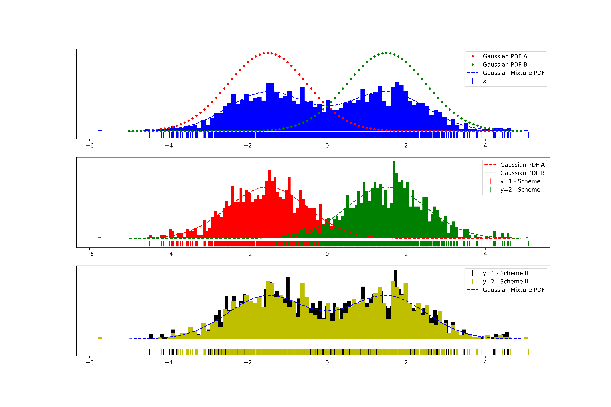

***********************
Memoryless Observations
***********************
On this page we provide the intuition for, and the theoretical underpinnings of our solutions to the **pre-learning** and **post-learning** problems in data science life cycles, when observations do not exhibit temporal structures to be exploited. For our treatment of time series, see the :ref:`Time Series` section.

I - Problem Formulation
=======================
A supervised learning problem (i.e. regression or classification) aims at reliably learning an association between 
a vector of inputs :math:`x` and a label :math:`y` that is either categorical or real-valued. The association is learned using a training dataset, with the hope that, given a value of the inputs vector never seen before, the associated label can be predicted with high enough accuracy.

While the adequacy of the learned association between :math:`x` and :math:`y` depends solely on the model used, the overal accuracy achieved is bound by how informative the inputs are about the label. If :math:`x` and :math:`y` are unrelated, no model, no matter 
how fancy or deep can infer :math:`y` from :math:`x`, and any attempt to do so would be a waste of time. 

1 - Pre-Learning
----------------
This waste of resources would be avoided if one would quantify how informative datasets intended to be used as inputs are about our label of interest :math:`y` prior to, and independently from any modeling, incluing features engineering. This endeavour is what we refer to as **pre-learning**.

.. admonition:: Definition

	**Pre-learning** is the study and selection of datasets to use to solve a supervised learning problem, prior to, and independently from any modeling.

2 - Post-Learning
-----------------
Once a set of informative inputs have been selected and a model has been trained, overall accuracy can be improved by either looking for a better supervised learning model, or looking for additional informative datasets to use. Determining which action would result in the highest ROI is the object of **post-learning**.

Because the learned model did not yield a satisfactory enough predictive accuracy, does not necessarily mean that a more elaborate model could do better using the same datasets. It is very possible that, although it has an unsatisfactory predictive accuracy, the learned model already factors in everything the input datasets can tell us about our label. In such an event, the only possible course of action would be 
to look for additional datasets to use.

Even then, because a new dataset is sufficiently informative about the label to predict does not necessarily mean that it can be used to improve the performance of our trained model. It is important to choose a dataset that is not only informative about the label to predict, 
but in a way that is complementary to datasets used to train the existing model.

.. admonition:: Definition

	**Post-learning** is the study of a trained supervised learning model, as well as courses of action to take to improve its predictive accuracy.

II - Quantifying Informativeness
================================
Whether in the pre-learning or post-learning phase, a key to success is the ability to quantify how informative a vector of inputs :math:`x` is about a label of :math:`y`. :math:`x` can either be categorical, continuous, or have both categorical and continuous coordinates. :math:`y` can either be continuous (in regression problems) or categorical (in classification problems).

As usual, we express our lack of knowledge and in-depth understanding about the dynamics of the phenomena giving rise to our inputs and/or label as randomness, and we model the inputs vector :math:`x` and the label :math:`y` as random variables. 

Our approach to quantifying the information content of a random variable and how informative one random variable is about another is routed in `information theory <https://en.wikipedia.org/wiki/Information_theory>`_, of which we recall key notions below. For a more detailed exposition see [1]_ and [2]_.

1 - Quantifying Information
---------------------------
The canonical way of quantifying the information content of a probability distribution :math:`\mathbb{P}` having density :math:`p` with respect to a base measure :math:`\mu` is its **entropy**, defined as

.. math::
	:label: rel_ent

	h(\mathbb{P}) := - \int p(x) \log p(x)  d\mu(x).

This notion extends to random variables in that the entropy of a random variable is, by definition, the entropy of its probability distribution

.. math::

	h(x) := h(\mathbb{P}_x).

When the logarithm above is the natural logarithm, which will be the case throughout unless stated otherwise, the unit of the entropy is nats. When the binary logarithm is used instead, the entropy is expressed in bits.

a) Shannon Entropy
^^^^^^^^^^^^^^^^^^
For a categorical random variable :math:`x` taking :math:`q` distinct values, the `i`-th with probability :math:`p_i`, the base measure is the counting measure, the density is the probability mass function (pmf), and the entropy reads

.. math::
	:label: sha_ent

	H(x) := - \sum_{i=1}^q p_i\log p_i.

This special case was first introduced by Claude Shannon, the father of information theory, in his seminal work [3]_, and is often referred to in the litterature as `Shannon entropy`. Some of its properties are found below.

.. admonition:: Properties

	#. :math:`0 \leq H(x) \leq \log q` for all categorical random variables.
	#. :math:`H(x) = \log q` if and only if :math:`x` is uniform (i.e. :math:`\forall i, ~ p_i = 1/q`).
	#. :math:`H(x, y) \leq H(x) + H(y)` for all categorical random variables :math:`x` and :math:`y`.
	#. :math:`H(x, y) = H(x) + H(y)` if and only if :math:`x` and :math:`y` are statistically independent.

b) Differential Entropy
^^^^^^^^^^^^^^^^^^^^^^^
When the random variable :math:`x` is continuous, takes values in :math:`\mathcal{C} \subset \mathbb{R}^d`, and its probability distribution admits density :math:`p` with respect to the Lebesgue measure, its entropy, also referred to in the litterature as `differential entropy`, reads

.. math::
	:label: dif_ent

	h(x) := - \int_{\mathcal{C}} p(x) \log p(x)  dx.

The base measure in this case is the Lebesgue measure, and :math:`p` is otherwise known as the `probability density function` (pdf) of :math:`x`. 

The differential entropy enjoys much of the same properties as Shannon's entropy, plus some scaling propertiees. A notable exception, however, is that `it is not necessarily non-negative`.

.. admonition:: Properties
	
	Let :math:`\text{Vol}(\mathcal{C}) = \int_{\mathcal{C}} dx` denote the possibly infinite volume of the range of the distribution.

	#. :math:`h(x) \leq \log \text{Vol}(\mathcal{C})`.
	#. If :math:`\text{Vol}(\mathcal{C}) < +\infty` then :math:`h(x) = \log \text{Vol}(\mathcal{C})` if and only if :math:`x` is uniform, i.e. :math:`p(x) = \mathbb{1} \left(x \in \text{Vol}(\mathcal{C}) \right)/\text{Vol}(\mathcal{C})`.
	#. :math:`h(x, y) \leq h(x) + h(y)` for all continuous random variables :math:`x` and :math:`y`.
	#. :math:`h(x, y) = h(x) + h(y)` if and only if :math:`x` and :math:`y` are statistically independent.
	#. :math:`h(x + c) = h(x)` for any deterministic constant :math:`c`.
	#. :math:`h(Ax) = h(x) + \log |\text{det}(A)|` for any deterministic invertible square matrix :math:`A`.

The fact that thee differential entropy can be negative warrants a slight detour to provide an intuition for why it is an appropriate measure of information content.

c) Typical Sets
^^^^^^^^^^^^^^^
Let :math:`x^{(n)}` be n i.i.d. draws from a (continuous or categorical) distribution :math:`\pi` with range :math:`\mathcal{C}` and (Shannon or differential) entropy :math:`h(\pi)`, and let :math:`p\left(x^{(n)}\right)` their likelihood. It follows from the weak law of large numbers that :math:`-\frac{1}{n} \log p\left(x^{(n)}\right)` converges in probability to :math:`h(\pi)`, meaning that

.. math::

	\forall \epsilon>0, ~~ \mathbb{P} \left( \left\vert -\frac{1}{n} \log p\left(x^{(n)}\right) - h(\pi) \right\vert > \epsilon \right) \underset{n \to + \infty}{\longrightarrow} 0.

	
Thus, if we define the sets

.. math::

	\mathcal{A}_\epsilon^{(n)} := \left\{ x^{(n)} \in \mathcal{C}^n ~~ \text{s.t.}~~  \left\vert - \frac{1}{n}\log p\left(x^{(n)}\right) - h(\pi) \right\vert \leq \epsilon  \right\}

then for any :math:`\epsilon>0`, no matter how small, we can always find :math:`n` large enough so that the full sequence :math:`x^{(n)}` lies in :math:`\mathcal{A}_\epsilon^{(n)}` with probability greater than :math:`1-\epsilon`:

.. math::

	\mathbb{P} \left( x^{(n)} \in \mathcal{A}_\epsilon^{(n)} \right) > 1-\epsilon.

As large enough sequences are very likely to belong to the sets :math:`\mathcal{A}_\epsilon^{(n)}`, they are called the **typical sets** of the distribution :math:`\pi`. Moreover, the size of typical sets can be used as proxy for gauging the information content or variability of a distribution. 

If we denote :math:`\text{Vol}\left( \mathcal{A}_\epsilon^{(n)}\right)` the volume (resp. cardinality) of :math:`\mathcal{A}_\epsilon^{(n)}` when :math:`\pi` is continuous (resp. categorical), then it can be shown that [*]_ for any :math:`\epsilon > 0` and for any large enough :math:`n`

.. math::
	:label: ent_ineq

	(1-\epsilon) e^{n(h(\pi) - \epsilon)} \leq \text{Vol}\left( \mathcal{A}_\epsilon^{(n)}\right) \leq e^{n(h(\pi) + \epsilon)}.

Given that we can choose :math:`\epsilon` arbitrarily small, it follows from inequalities :eq:`ent_ineq` that the information content of a continuous (resp. categorical) distribution or random variable increases with its differential (resp. Shannon) entropy. Consequently, the differential entropy, even when negative, measures the information content of a random variable. In fact, :math:`e^{nh(\pi)}` can be interpreted as the number of nats (:math:`1\text{nat}=(1/\log2)\text{bit})` required to encode the sequence :math:`x^{(n)}`, whether the distribution is categorical or continuous.

d) Conditional Entropy
^^^^^^^^^^^^^^^^^^^^^^
In case a random variable :math:`x \in \mathcal{C}_x` is suspected to be informative about another random variable :math:`y \in \mathcal{C}_y`, one might want to quantify the extent to which knowing :math:`x` affects our uncertainty about, or the information content of :math:`y`. If  :math:`x` and :math:`y` are either both continuous or both categorical, the **conditional entropy**, defined as 

.. math::
	:label: cond_ent_1

	h\left(y \vert x \right) := h(x, y) - h(x),

quantifies the information content of (or the amount of uncertainty about) :math:`y` that remains despite knowing :math:`x`.

.. figure:: ../../../images/entropy_venn.png
	:width: 750px
	:align: center
	:height: 175px
	:alt: Joint entropy Venn diagram
	:figclass: align-center

	Fig 1. Venn diagram illustrating joint and conditional entropies.

A direct consequence of property **P3** above is that, both in the case of categorical and continuous random variables, :math:`h\left(y \vert x \right) \leq h(y)`. Said differently, knowning the value of a random variable :math:`x` cannot increase our uncertainty about, or the information content of random variable :math:`y`. Moreover, it follows from **P4** that knowning the value of a random variable :math:`x` leaves the uncertainty about :math:`y` unchanged if and only if :math:`x` and :math:`y` are statistically independent. 

Going forward and without lack of generality, when a categorical random variable takes :math:`q` distinct values, we will assume these values are :math:`1, \dots, q`.

A useful insight in the conditional entropy is provided by its linked to conditional distributions. We recall that the conditional distribution of :math:`y` given a specific value of :math:`x`, which we denote :math:`y|x=*` is the distribution with pmf

.. math::

	\mathbb{P}(y=i \vert x=*) := \frac{\mathbb{P}\left(y=i, x=*\right)}{\mathbb{P}(x=*)}

when :math:`x` and :math:`y` are both categorical, or the distribution with pdf 

.. math::

	p(y \vert x=*) = \frac{p(*, y)}{\int_{\mathcal{C}_y} p(*, y) dy}

when :math:`x` and :math:`y` are both continuous. 

As its name suggests, the conditional distribution models the behavior of :math:`y` after a specific value :math:`*` of :math:`x` has been observed, irrespective of how likely said value is. Its entropy :math:`h\left(y \vert x=* \right)` is a function of the observed value of :math:`x`, and it turns out that the average value of :math:`h\left(y \vert x=* \right)` weighted by how likely the value :math:`*` is, happens to be the conditional entropy

.. math::
	:label: cond_ent_2

	h\left(y \vert x \right) = E_x \left[h\left(y \vert x=* \right)\right].

e) Mixed Entropy
^^^^^^^^^^^^^^^^
It follows from Equations :eq:`cond_ent_1` and :eq:`cond_ent_2` that

.. math::
	:label: joint_ent

	h(x, y) &= h(x) +  E_x \left[h\left(y \vert x=* \right)\right] \\
		    &= h(y) +  E_y \left[h\left(x \vert y=* \right)\right]

when :math:`x` and :math:`y` are either both continuous or both categorical. 

When one variable is categorical (for instance :math:`y`), and the other continuous (for instance :math:`x`), the joint distribution of :math:`(x, y)` is fully defined through the pmf of :math:`y`, namely :math:`\mathbb{P}(y=i) := p_i`, and the :math:`q` conditional pdfs :math:`p\left(x \vert y=i \right)`. 

In such a case, the entropy can be evaluated from Equation :eq:`rel_ent` using as base measure space the product of the Lebesgue measure space and :math:`\mathbb{Z}` endowed with the counting measure, using as base measure the induced measure, and by working out the induced density function. 

Alternatively, the entropy can also be obtained by applying the result in Equation :eq:`joint_ent`:

.. math::
	:label: mixed_ent

	h(x, y) = H(y) + \sum_{i=1}^q p_i h\left(x \vert y=i \right).

2 - Association and Copula
--------------------------
Another important mathematical construct in the study of associations between continuous random variables are **copulas**. 

Let :math:`x = (x_1, \dots, x_d) \in \mathcal{C} \subset \mathbb{R}^d` be a continuous random variable, :math:`F` its cummulative density function (cdf) and :math:`F_i` the cdf of its `i`-th coordinate :math:`x_i`. It can be shown that :math:`u_i := F_i(x_i)`, also denoted the `probability integral transform` of :math:`x_i`, is uniformly distributed on :math:`[0, 1]`. 

We refer to 

.. math::

	u := \left(F_1(x_1), \dots, F_d(x_d)\right) 

as the **copula-uniform dual representation** of :math:`x`, and we denote :math:`C` (resp. :math:`c`) the cdf (resp. pdf) of :math:`u`.

.. note::

	:math:`C` is called the **copula** of :math:`x`. More generally, a copula is any mathematical function that is the cdf of a distribution with uniform marginals. 

a) Sklar's Theorem
^^^^^^^^^^^^^^^^^^
It is worth pointing out that, as stated by Sklar's theorem, every multivariate cdf can be expressed in terms of its copula and its marginals in the following way

.. math::

	F(x_1, \dots, x_d) = C\left(F_1(x_1), \dots, F_d(x_d) \right),

and the copula :math:`C` is the only function satisfying such as a decomposition when the marginals :math:`F_i` are continuous. Thus, while marginals :math:`u_i` are all standard uniform, their joint distribution fully reflects the dependence structure between coordinates of :math:`x`.

b) Copula and Structure
^^^^^^^^^^^^^^^^^^^^^^^
We note that any strictly increasing transformation on coordinates :math:`x_i` would change their marginals but would leave their copula invariant when the marginals :math:`F_i` are continuous. 

Indeed, if :math:`f_i` are :math:`d` increasing transformations and :math:`y := \left(f_1(x_1), \dots, f_d(x_d)\right)` whith cdf :math:`G`, then we have 

.. math::

	G(y_1, \dots, y_d) :&= \mathbb{P} \left(f_1(x_1) \leq y_1, \dots, f_d(x_d) \leq y_d \right) \\
					    &= \mathbb{P} \left(x_1 \leq f_1^{-1}(y_1), \dots, x_d \leq f_d^{-1}(y_d)\right) \\
					    &= C \left(F_1\left(f_1^{-1}(y_1) \right), \dots, F_d\left(f_d^{-1}(y_d) \right) \right) \\
					    &= C \left(G_1(y_1), \dots, G_d(y_d)\right),

which by Sklar's theorem implies that :math:`C` is also the copula of :math:`y`.

This result is very important because it provides a sense in which marginal distributions solely reflect how the underlying phenomena were observed or used datasets were prepared (e.g. standardizing or not, taking the logarithm or not, squashing through a sigmoid-like function or not etc.), whereas the copula fully captures the dependence structure in the underlying phenomena irrespective of how they were observed.

.. important::

	Marginals are a property of data vendors and data teams, copulas characterize the structure in your problem. You should study your problem, not your data vendor.

Another perspective on why copulas capture association between random variables is provided by the expression of the copula density :math:`c` as a function of the joint and marginal primal densities:

.. math::
	:label: cop_dens

	c(u_1, \dots, u_d) = \frac{p(x_1, \dots, x_d)}{ \prod_{i=1}^d p(x_i)} = \frac{p\left(x_i \vert \dots, x_j, \dots, i \neq j \right)}{p(x_i)}.

The copula density is the ratio of the actual joint (resp. conditional) density, and the joint (resp. conditional) density had there been no association betweeen coordinates. 

Moreover, the copula-uniform dual distribution is the uniform distribution on the hypercube :math:`[0, 1]^d` if and only if coordinates :math:`x_i` are statistically independent.

c) Entropy Decomposition
^^^^^^^^^^^^^^^^^^^^^^^^

It follows from Equation :eq:`cop_dens` that the entropy of a continuous random variable :math:`x` can be broken down as the sum of the entropies of its marginals and the entropy of its copula-uniform dual representation,

.. admonition:: Property

	.. math::
		:label: fund_ent

		h(x) = h(u) + \sum_{i=1}^d h(x_i).

This Equation is fundamental as it allows us to break down the estimation of the entropy of :math:`x` in two stages: estimating the entropy of its marginals when it is really needed, and estimating the entropy of its copula. As we will see later, both stages are easier to solve than directly estimating the entropy of :math:`x` and, in many cases, the entropies of marginals will cancel each other out in informativeness metrics.

3 - Quantifying Association
---------------------------
If the entropy is the canonical measure of information content, and copulas the canonical approach for `modeling` associations between random variables, the **mutual information** is the canonical approach for `quantitying` associations between random variables.

a) Mutual Information
^^^^^^^^^^^^^^^^^^^^^
In plain english, the mutual information between random variables :math:`x` and :math:`y`, denoted :math:`I(x; y)`, is the information content of :math:`x` that relates to :math:`y` or, equivalently, the information content of :math:`y` that relates to :math:`x`. It is formally defined as 

.. math::
	:label: mi
	
	I(x; y) :&= h(x) + h(y) - h(x, y) \\
			&= h(x) - h(x|y) \\
			&= h(y) - h(y|x).

One of the most important properties of mutual information is that it is invariant by invertible transformations. [*]_

.. admonition:: Property

	Let :math:`x` and :math:`y` be two random variables, and let :math:`f` and :math:`g` be two invertible functions defined on the ranges of :math:`x` and :math:`y` respectively. Then 

	.. math::
		:label: invariance

		I\left(f(x); g(y) \right) = I\left(x; y\right).

b) Conditional Mutual Information
^^^^^^^^^^^^^^^^^^^^^^^^^^^^^^^^^
Similarly, we can define the **condition mutual information** between random variables :math:`x` and :math:`y` given a third random variable :math:`z` as the information content of :math:`x` that relates to :math:`y` (or equivalently the information content of :math:`y` that relates to :math:`x`) when :math:`z` is known:

.. math::
	:label: mic
	
	I(x; y|z) :&= h(x|z) + h(y|z) - h(x, y|z) \\
			   &= h(x|z) - h(x|y,z) \\
			   &= h(y|z) - h(y|x,z) \\
			   &= h(x, z) + h(y, z) - h(z) - h(x, y, z) \\
			   &= h(x, z) + h(y) - h(x, y, z) - h(y) - h(z) + h(y, z) \\
			   &= I(y; x, z) - I(y; z).

.. note::

	It follows from the equation above that the conditional mutual information is the expected value of the mutual information between the conditional distributions :math:`x \vert z=*` and :math:`y \vert z=*`

	.. math::

		I(x; y|z) = E\left[ I\left(x \vert z=*; y \vert z=*\right) \right].

c) Mutual Information and Copula
^^^^^^^^^^^^^^^^^^^^^^^^^^^^^^^^
When :math:`x` and :math:`y` are both continuous, we can use Equation :eq:`fund_ent` to show that the mutual information between :math:`x` and :math:`y` is in fact unrelated to their marginal distributions, and is simply equal to the mutual information betweeen their copula-uniform dual representations.

.. admonition:: Property

	.. math::
		:label: fund_mi
		
		I(x; y) &= h(u_x) + h(u_y) - h(u_x, u_y) \\
				&= I(u_x, u_y)

.. note::

	When either :math:`x` or :math:`y` is one-dimensional, the associated copula-uniform dual representation is uniformly distributed on :math:`[0, 1]` and has entropy 0.

When one of the two variables is categorical, for instance :math:`y`, and the other multidimensional and continuous, the mutual information between :math:`x` and :math:`y` can be broken down as the sum of the mutual information between :math:`y` and the copula-uniform representation of :math:`x` and the mutual information between coordinates :math:`x_i` and :math:`y`.

.. admonition:: Property
	
	When :math:`x` is continuous with copula-uniform dual representation :math:`u` and :math:`y` is categorical, 

	.. math::
		:label: fund_mi_2

		I(x; y) :&= h(x) - \sum_{i=1}^q p_i h(x|y=i) \\
	             &= \underbrace{\left[h(u) - \sum_{i=1}^q p_i h(u|y=i) \right]}_{\text{Copula Mutual Information}} + \underbrace{\left[\sum_{j=1}^d h(x_j) - \sum_{i=1}^q p_i h(x_j|y=i) \right]}_{\text{Marginal Mutual Information}} \\
	             &= I(u; y) + \sum_{j=1}^d I(x_j; y)

A similar result can be obtained for the mutual information between :math:`(x, z)` and :math:`y` when :math:`x` is continuous and :math:`z` and :math:`y` are categorical.

.. admonition:: Property
	
	When :math:`x` is continuous with copula-uniform dual representation :math:`u`, and :math:`y` and :math:`z` are categorical, 

	.. math::
		:label: fund_mi_3

		I(x, z; y) = I(y; z) + I(u; y|z) + \sum_{j=1}^d I(x_j; y | z).

Finally, we provide the result when :math:`x` and :math:`y` are continuous and :math:`z` is categorical.

.. admonition:: Property
	
	When :math:`x` and :math:`y` are continuous with copula-uniform dual representations :math:`u_x` and :math:`u_y`, and :math:`z` is categorical, 

	.. math::
		:label: fund_mi_4

		I(x, z; y) = I(y; z) + I(u_x; u_y | z).

d) Quantifying Informativeness
^^^^^^^^^^^^^^^^^^^^^^^^^^^^^^
Now that we are equipped with the right tools, we can answer the question that is central to pre-learning and post-learning: `how informative are a collection of inputs` :math:`x` `about a label` :math:`y`?

.. important::

	**Given two random variables, the extent to which one is informative about the other can be quantified using their mutual information.** When both variables are categorical, Equation :eq:`mi` is used and individual entropy terms are Shannon entropies (Equation :eq:`sha_ent`). When both variables are continuous, Equation :eq:`fund_mi` is used. When one variable is continuous and the other categorical, Equation :eq:`fund_mi_2` is used. When one variable is categorical and the other has continuous and categorical coordinates, Equation :eq:`fund_mi_3` is used. Finally, when one variable is continuous and the other has continuous and categorical coordinates, Equation :eq:`fund_mi_4` is used.

	

III - Applications
==================

In this section we consider memoryless classification and regression problems. We refer the reader to the :ref:`Time Series` section for problems exhiting temporal structures and methods actively attempting to exploit those.

1 - Pre-Learning Problems
-------------------------
Pre-learning problems are problems arising in the study and selection of datasets to use to solve a supervised learning problem, prior to, and independently from any modeling (or feature engineering).

a) Input Importance
^^^^^^^^^^^^^^^^^^^
We consider using an input :math:`x_i` to predict the label :math:`y`. To do so, we need to determine how relevant this input is for the task at hand, prior to and independently from doing any modeling. We do this by computing the mutual information between :math:`x_i` and :math:`y`, in a model-free fashion. 

Thanks to the invariance of mutual information by invertible transformations, this answer is robust to any (invertible) feature engineering transformation applied to :math:`x_i`. Thus, we may quantify how important an input is for predicting the label of interest prior to, and independent from feature engineering. 

We do not need to learn an accurate generative model for :math:`(y, x_i)` as a pre-requisite for quantifying feature importance either. We discuss model-free estimation in depth in section :ref:`IV - Model-Free Estimation`. For now it suffices to say that we will gather nonparametric empirical evidence illustrating the association between :math:`x_i` and :math:`y`, and use as probability distribution for :math:`(x_i, y)` the one,  among all possible probability distributions that are consistent with observed empirical evidence, under which :math:`x_i` is the least informative about :math:`y`.

i) Classification
"""""""""""""""""
In classification problems, :math:`y` is categorical. Without loss of generality, we assume it takes values in :math:`\mathcal{C}_{y} = \{1, \dots, q\}` with probabilities :math:`(p_1, \dots, p_q)`.

When :math:`x_i` is also categorical, we have

.. admonition:: Important Equation

	.. math::
		:label: fi_dd

		FI(x_i; y) = H(x_i) + H(y) - H(x_i, y)

where :math:`H` refers to the Shannon entropy (Equation :eq:`sha_ent`). When :math:`x_i` is continuous, we have

.. admonition:: Important Equation

	.. math::
		:label: fi_cd

		FI(x_i; y) &= h(x_i) - \sum_{j=1}^q p_j h(x_i | y=j) \\
                   &= \sum_{j=1}^q p_j \left[h(x_i) - h(x_i | y=j) \right]

where :math:`h(x_i | y=j)` is simply the differential entropy (Equation :eq:`dif_ent`) of the conditional distribution :math:`x_i | y=j`. To form an intuitive understanding of Equation :eq:`fi_cd`, let's consider a toy example.

**Example:** We use as distribution for :math:`x_i` the equally weighted mixture between two Gaussians A and B, both with standard deviation 1, and respective mean :math:`\mu=-1.5` and :math:`-\mu`. We draw :math:`2000` i.i.d. input samples from the mixture, and we consider two label allocation schemes.

* **Scheme I**: we give label 1 to draws that came from A and label 2 to draws that came from B.
* **Scheme II**: we attribute label 1 and 2 to draws uniformly at random.

	Fig 2. Illustration of classification input importance metric.

The entropy of the Gaussian mixture can be found to be :math:`h(x_i) \approx 1.9457`. In Scheme I, the conditional distributions :math:`x_i | y=j` are both Gaussian with standard deviation 1, but different means. Their entropy is :math:`0.5\log \left(2\pi e\right) \approx 1.4189`, which yields an input importance score of :math:`0.5268` nats. In Scheme II on the other hand, the conditional distributions :math:`x_i | y=j` are the same as the unconditional distribution of :math:`x_i`, leading to an input importance score of :math:`0` nat.

As we discussed in section :ref:`d) Conditional Entropy`, conditioning never increases an entropy. Hence,

.. math::

	\forall j, ~ h(x_i) - h(x_i|y=j) \geq 0.

In practical terms, a smaller entropy reflects less variability (see section `c) Typical Sets`_). Thus, the input importance score is high if and only if one or multiple differences :math:`h(x_i) - h(x_i|y=j)` is high, meaning that the label :math:`y` induces a partition of the input distribution into less spreadout conditional distributions. 

The best case scenario occurs when the conditional distributions :math:`x_i|y=j` have as little an overlap as possible, for instance when the distribution of the input :math:`x_i` is multi-modal with deep valleys between modes, and :math:`y` indicates the mode cluster to which the associated :math:`x_i` belongs. 

The worst case scenario always occurs when conditional distributions are identical, in which case they ought to be identical to the input unconditional distribution. This point is further illustrated in the animation below, where we vary the mean term :math:`\mu` between :math:`-3` and :math:`3`.

.. figure:: ../../../images/gm_separability_mov.gif
	:width: 800px
	:align: center
	:height: 550px
	:figclass: align-center

	Fig 3. Impact of clustering on classification input importance.

ii) Regression
""""""""""""""
In regression problems, :math:`y` is continuous. When :math:`x_i` is continuous, the input importance is the negative of the differential entropy of their copula:

.. admonition:: Important Equation

	.. math::
		:label: fi_cc

		FI(x_i; y) = -h\left(u_{x_i}, u_y\right)

where :math:`u_{x_i}` (resp. :math:`u_y`) is the copula-uniform dual representation of :math:`x_i` (resp. :math:`y`). We recall that it is always non-negative, and equals :math:`0` if and only if input and label are statistically independent.

When :math:`x_i` is discrete, the input importance is the same as in classification problems with a continuous features (Equation :eq:`fi_cd`), except that :math:`x_i` becomes :math:`y` and vice versa.

b) Problem Feasibility
^^^^^^^^^^^^^^^^^^^^^^
The feasibility question is the generalization of the input importance question to a collection of inputs. Given :math:`d` inputs :math:`x=(x_1, \dots, x_d)` we would like to know how informative they are, collectively, about a label :math:`y`. 

If the inputs are not informative about our label, no model, no matter how fancy, can successfully predict our label :math:`y` using :math:`x`. In such an event, no model based solely on :math:`x` should be expected to consistently outperform the naive strategy consisting of always predicting that :math:`y` is equal to its mode.

To quantify how useful a set of inputs are collectively at predicting the label of interest, it is not enough to evaluate the importance of each input in isolation. Some inputs might be redundant, leading to a collective informativeness smaller than the sum of the individual input importance scores. Some inputs might be complementary, to the point that their collective informativeness might be greater than the sum of their individual input importance scores.

.. admonition:: Definition

	We define the **feasibility of a supervised learning problem** using inputs :math:`x` to predict label :math:`y` as the mutual information between :math:`x` and :math:`y`,

	.. math::
		:label: feas

		FE(x; y) := I(x; y).

i) Data Processing Inequality
"""""""""""""""""""""""""""""
Let us consider a model :math:`\mathcal{M}` predicting the value :math:`f(x)` for :math:`y` given a collection of inputs :math:`x`. The more accurate :math:`\mathcal{M}` is, the closer :math:`f(x)` will be to :math:`y`, and the higher the mutual information :math:`I(f(x); y)`. Thus, :math:`I(f(x); y)` can be regarded as a proxy for the accuracy of model :math:`\mathcal{M}`. 

The highest possible value for :math:`I(f(x); y)` happens to be the mutual information between :math:`x` and :math:`y`, as implied by the **data processing inequality**, which we recall below.

.. important:: 
	
	For any function :math:`f`, for any random variables :math:`x` and :math:`y`, :math:`I(x; y) \geq I(f(x); y)`. Moreover, the equality holds when either :math:`f` is invertible or :math:`x` and :math:`y` are independent conditional on :math:`f(x)`, :math:`x \perp y ~\vert~ f(x)`. [*]_

Thus, our feasibility score can be interpreted as the **highest possible mutual information between any predictor of** :math:`y` **using only inputs** :math:`x` **and the label** :math:`y`.

ii) Classification Feasibility
""""""""""""""""""""""""""""""
In classification problems, :math:`y` is categorical. When inputs :math:`x=(x_1, \dots, x_d)` are all continuous and have copula-uniform representation :math:`u`, 

.. admonition:: Important Equation

	.. math::
		:label: fe_c_clas

		FE(x; y) = I(u; y) + \sum_{j=1}^d I(x_j; y).

When inputs are continuous and categorical, without loss of generality we assume there is only one categorical input :math:`z`, and :math:`d` continuous inputs :math:`x=(x_1, \dots, x_d)` with copula-uniform representation :math:`u`. The feasibility score reads

.. admonition:: Important Equation

	.. math::
		:label: fe_m_clas

		FE(x, z; y) = I(y; z) + I(u; y|z) + \sum_{j=1}^d I(x_j; y | z).

iii) Regression Feasibility
"""""""""""""""""""""""""""
In regression problems, :math:`y` is continuous and real-valued. If we denote :math:`u_x` (resp. :math:`u_y`) the copula-uniform dual representation of :math:`x` (resp. :math:`y`), then the feasibility score reads

.. admonition:: Important Equation

	.. math::
		:label: fe_c_reg

		FE(x; y) = I(u_x; u_y).

When there is a categorical input :math:`z`, the feasibility score reads 

.. admonition:: Important Equation

	.. math::
		:label: fe_m_reg

		FE(x, z; y) = I(y; z) + I(u_x; u_y | z).

2 - Post-Learning Problems
--------------------------
Post-learning problems are problems arising in the study of a trained supervised learning model, as well as how to improve its predictive accuracy.

a) Model Suboptimality
^^^^^^^^^^^^^^^^^^^^^^
Once a model has been learned, it is important to get a sense for whether it could be improved without resorting to additional inputs, and if so, to what extent.

i) Suboptimality
""""""""""""""""
Let us consider a model :math:`\mathcal{M}` predicting that the label :math:`y` associated to :math:`x` is :math:`f(x)`. As previously discussed, :math:`I\left(f(x); y\right)` reflects how accurate :math:`\mathcal{M}` is, and, by the data processing inequality, the highest possible value for :math:`I\left(f(x); y\right)` is :math:`I\left(x; y\right)`. Thus,

.. admonition:: Important Equation

	.. math::
		:label: subopt

		SO(\mathcal{M}) :&= I(x; y)-I\left(f(x); y\right) \\
						 &= I(x; y | f(x))

is a natural measure of how suboptimal :math:`\mathcal{M}` is. Note that, using :math:`SO`, :math:`\mathcal{M}` is optimal if and only if :math:`x` and :math:`y` are statistically independent conditional on :math:`f(x)`, meaning that :math:`f(x)` fully captures everything there is in :math:`y` about :math:`x`, and as such :math:`\mathcal{M}` cannot be improved.

ii) Additive Suboptimality
""""""""""""""""""""""""""
:math:`SO` assesses the extent to which a trained regression or classification model, can be improved without resorting to additional inputs, and without restrictions on how such improvement would come about. 

In some regression problems, the data scientist might be constrained to work in an incremental and additive fashion, first learning a model

.. math::

	y = f_1(x) + \epsilon_1

where :math:`f_1` is chosen in a family of candidate functions capturing a specific stylized fact, then refining it iteratively in an additive fashion by solving the regression problem 

.. math::

	\epsilon_i = f_{i+1}(x) + \epsilon_{i+1}

where :math:`f_{i+1}` is chosen in a family of candidate functions :math:`\mathcal{F}_{i+1}` that encodes more subtle properties than the previous family :math:`\mathcal{F}_{i}`. The overall model reads

.. math::

	y = \sum_{i=1}^k f_i(x) + \epsilon_k.

In such a setup, it is important for the data scientist to know at which :math:`k` to stop. To this end, we introduce the **additive suboptimality score**

.. admonition:: Important Equation

	.. math::

		ASO(\mathcal{M}) = I(y-f(x); x),

where :math:`f(x) := \sum_{i=1}^k f_i(x)` represents the running regression model. It can be shown that

.. math::

	I(x; y) = h(y) - h(y-f(x)) + I(y-f(x); x).

Hence,

.. math::
	
	ASO(\mathcal{M}) = SO(\mathcal{M}) + \underbrace{h(\epsilon) - h(y)}_{\text{Additive Penalty}}.
	

.. note::

	The entropy or variability of the residual :math:`\epsilon` will typically be smaller than that of :math:`y`, and the additive suboptimality score will be smaller than the suboptimality score as a result.

b) Dataset Valuation
^^^^^^^^^^^^^^^^^^^^
Once it has been determined that the trained model cannot be significantly improved without adding new inputs, the next question is what inputs to add? Rather than proceeding by trial and error, we provide a rigorous framework to answer this question, prior to allocating any resources to further modeling. 

We define the value of adding new inputs :math:`x^\prime` as the difference between the feasibility scores with and without the new inputs:

.. admonition:: Important Equation

	.. math::

		FE(x, x^\prime; y) - FE(x; y).

c) Model Explanation
^^^^^^^^^^^^^^^^^^^^
Understanding how models arrive at their decisions is a key requirement and challenge for many industries. It comes with multiple needs, one of which is understanding what inputs drive the learned model the most, in general, or under specific circumstances.

Assessing how much a trained model :math:`\mathcal{M}` relies on a specific input :math:`x_i` on average is identical to the discussion of section :ref:`a) Input Importance`, except that the true label :math:`y` is replaced by the predicted label :math:`y_p=f(x)`:

.. admonition:: Important Equation

	.. math::

		ME(x_i; \mathcal{M}) = I(x_i; y_p) = FI(x_i; y_p).

This approach extends to many scenario-specific situations. For instance, to assess how complementary the effects of two inputs :math:`x_i` and :math:`x_j` on :math:`\mathcal{M}` are, we can compute the conditional mutual information 

.. math::
	
	I(y_p; x_j | x_i).

d) Model Bias
^^^^^^^^^^^^^
The ability to spot biases in trained machine learning models is increasingly important, as society becomes more and more `AI-powered`. Detecting bias could be done by determining whether the category variable :math:`z`, upon which bias or discrimination could be based (e.g. race, gender, income level, etc.), has any implicit bearing on decision making. 

As usual, this could be done by computing the mutual information between model predictions :math:`y_p=f(x)` and :math:`z`

.. admonition:: Important Equation

	.. math::

		Bias(\mathcal{M}; z) = I(z; y_p).

For :math:`z` to have no bearing on :math:`\mathcal{M}`, :math:`Bias(\mathcal{M}; z)` should be as close to :math:`0` as possible.

Often times, models will not directly make use of the category variable :math:`z`, for legal or ethical reasons. In such an instance, it is important to understand which inputs implicitly induce the bias. This could be done `ex-post` by comparing the overall impact of each input :math:`x_i` on the decision :math:`y_p` to its impact on :math:`y_p` for a specific group :math:`z=j`,

.. math::

	\left\vert I(x_i; y_p) - I(x_i; y_p | z=j) \right\vert.

If this difference is not close to :math:`0`, the data scientist should ask herself whether it is fair or ethical to treat individuals in group :math:`j` differently from another individual with the same input characteristic :math:`x_i`. If the answer is no, then chances are that the empirical distribution :math:`(x_i, y) | z=j` as per the training dataset was not representative of the true data generating distribution :math:`x_i, y`, in which case the data scientist should collect additional samples from group :math:`j`.

IV - Model-Free Estimation
==========================
For the purposes of pre-learning and post-learning, estimation ought to be performed in a model-free fashion. In effect, pre-learning problems are concerned with studying and selecting datasets to solve a supervised learning problem, prior to, and independently from any modeling. As such, they cannot be constrained by a specific choice of a generative model for inputs and the label :math:`(x, y)`. Not to mention that some pre-learning metrics (e.g. Equations :eq:`fi_cc` and :eq:`fe_c_reg`) do not depend on marginal distributions, in which case it would be a shame to posit an arbitrary and possibly restrictive full generative model for inputs and the label, only to make use of their copulas.

Similarly, post-learning aims at studying trained supervised learning problems in a general-purpose fashion, as well as courses of action to take to improve their accuracies. This cannot be achieved with a specific choice of a generative model for inputs and the label :math:`(x, y)`. Having said that, before delving further, let's review the elementary quantities we need to estimate from i.i.d. samples.

If we are able to estimate the `Shannon entropy`, the `differential entropy for scalar random variables`, and the `entropy of the copula of a vector random variable`, then we can compute all metrics discussed above. To estimate the entropy of a conditional distribution where the condition is on the specific value of a categorical variable, it suffices to use as sample the subset of the full sample where the condition is met, and then estimate the unconditional entropy from the foregoing subset. To estimate a conditional entropy (resp. mutual information) where conditioning is based on a categorical variable (not a specific value thereof), we recall that it is equal to the average value of the entropy (resp. mutual information) of the conditional distribution(s), which we estimate as previously discussed, weighted by the probability of each outcome.

We make it a point never to estimate the entropy of continuous random vector directly. As previously discussed, in matters pertaining to quantifying associations, the copula of a random vector plays a more central role than its marginals. While the copula of a random vector fully (and only) captures associations between its coordinates, its marginals are heavily influenced by how the sample was gathered and invertible feature transformations it might have undergone (e.g. logarithm transformation, standardization, etc.). Intuitively, no invertible transformation applied to coordinates should affect our understanding of associations between them. Such transformations, when increasing, would indeed leave the copula invariant, but would affect the marginals.

1 - Shannon Entropy
-------------------
We estimate the entropy of categorical random variables using the plug-in estimator

.. math::
	:label: ent_ent_est

	\hat{H} = -\sum_{i=1}^q \hat{p}_i \log \hat{p}_i,

where :math:`\hat{p}_i` is the frequency or MLE estimator of the :math:`i`-th category. This is consistent and asymptocially normal estimator. [*]_

2 - Univariate Differential Entropy
-----------------------------------
We estimate the entropy of a continuous scalar random variable :math:`x` from n i.i.d samples :math:`x_1, \dots, x_n` using the standard 1-spacing estimator:

.. math::

	\hat{h}(x) = - \gamma(1) + \frac{1}{n-1} \sum_{i=1}^{n-1} \log \left[ n \left(x_{(i+1)} - x_{(i)} \right) \right],

where :math:`x_{(i)}` is the i-th smallest sample, and :math:`\gamma` is the digamma function. See [5]_ and references therein for a review of its statistical properties.

3 - Multivariate Copula Entropy
-------------------------------
We consider estimating the differential entropy :math:`h(u)` of the copula of a continuous random variable :math:`x` with range :math:`\mathcal{C} \subset \mathbb{R}^d` and copula-uniform dual representation :math:`u` with pdf :math:`c`, from :math:`n` i.i.d. samples :math:`x^{(n)} = \left(x_1, \dots, x_n \right)`.

a) Problem Formulation
^^^^^^^^^^^^^^^^^^^^^^
We do not attempt to generate the copula-uniform representations of our i.i.d. samples, namely, :math:`u^{(n)}`. This would require accurately modeling all marginal cdfs, which is not the object of interest here and, as previously discussed, we should refrain from having to learn or say anything about marginals as a pre-requisite for learning copulas. 

Instead, we assume we may form a good statistical estimator of the functional 

.. math::
	:label: cons_func

	c \to E\left(\phi(u)\right) := \int_{[0, 1]^d} \phi(u)c(u) du

for some function :math:`\phi: [0, 1]^d \to \mathbb{R}^q`, straight from :math:`x^{(n)}`. The function :math:`\phi` is chosen so that the functional :math:`E\left(\phi(u)\right)` measures the association between coordinates of the copula-uniform representation :math:`u`, and so that we may rely solely the value of :math:`E\left(\phi(u)\right)` to gauge any association between coordinates of :math:`u`.

b) The Maximum Entropy Principle
^^^^^^^^^^^^^^^^^^^^^^^^^^^^^^^^
For a given value :math:`\alpha \in \mathbb{R}^q`, we ask ourselves the question: among all copulas that satisfy 

.. math::
	:label: cons_func_alpha

	E\left(\phi(u)\right) = \alpha,

which copula is the most uncertain about everything we have not explicitly observed or, equivalently, which copula posits the least amount of structure or informativeness between coordinates of :math:`u`? This copula happens to be the one with the smallest entropy among all copulas satisfying the constraint :eq:`cons_func_alpha`. 

This modeling paradigm, known as `the principle of maximum entropy <https://en.wikipedia.org/wiki/Principle_of_maximum_entropy>`_, was first pioneered by E.T. Jaynes, one of the most celebrated authors in the probabilistic machine learning community, in his seminal works [6]_ and [7]_.

To summarize, to estimate :math:`h(u)` we proceed in 3 stages:

* **Stage 1**: Choose a function :math:`\phi` so that :math:`E\left(\phi(u)\right)` measures the association between coordinates of :math:`u` and can be properly estimated from :math:`x^{(n)}`, :math:`n` i.i.d samples of :math:`x`.
* **Stage 2**: Compute an estimator of :math:`\alpha := E\left(\phi(u)\right)` from :math:`x^{(n)}`, say :math:`\hat{\alpha}_n`.
* **Stage 3**: Use as estimator for the entropy of the copula the solution to the variational optimization problem

.. math::

	\hat{h}(u) = \Bigg\{ 
	\begin{align}
	&\underset{c \in \mathcal{Co}}{\max} ~ \int_{[0, 1]^d} -c(u) \log c(u) du \\
	&\text{s.t.} ~~ \int_{[0, 1]^d} \phi(u)c(u) du = \hat{\alpha}_n
	\end{align}

where :math:`\mathcal{Co}` is the space of all :math:`d`-dimensional copula densities.

	

c) Choice of Maximum Entropy Constraints
^^^^^^^^^^^^^^^^^^^^^^^^^^^^^^^^^^^^^^^^

The two primary requirements guiding the choice of the constraint function :math:`\phi` are 

#. :math:`E\left(\phi(u)\right)` should reflect depedence between coordinates of the copula-uniform dual representation :math:`u` or, equivalently, between coordinates of :math:`x`.
#. :math:`E\left(\phi(u)\right)` should be amenable to efficient and robust estimation from i.i.d. samples of :math:`x`,  :math:`x_1, \dots, x_n`.

These requirements are satisfied by a plethora of concordance measures, among which Spearman's rank correlation, Kendall's tau, Gini's gamma, Blest's measures, to name but a few. Simply put, concordance measures (Definition 5.1.7 in [4]_) quantify the extent to which two random variables take large (resp. small) values at the same time. 

i) Kendall's Tau
""""""""""""""""

An example directly in line with this interpretation is Kendall's tau (or Kendall's rank correlation), defined as 

.. math::

	\tau = \mathbb{P} \left((x_1-x_2)(y_1-y_2) > 0\right) - \mathbb{P} \left((x_1-x_2)(y_1-y_2) < 0\right)

where :math:`(x_1, y_1)` and :math:`(x_2, y_2)` are independent draws from the same bivariate distribution with copula-uniform dual representation :math:`(u, v)` and copula :math:`C(u, v)`. It can be expressed in terms of the copula-uniform dual representation as 

.. math::

	\tau = E\left( C(u, v)\right),

and its sample estimate from n i.i.d. draws of :math:`(x, y)` reads

.. math::
	
	\hat{\tau} = \frac{2}{n(n-1)} \sum_{i<j} \text{sgn}(x_i-x_j)\text{sgn}(y_i-y_j).

**Interpretation:** :math:`\mathbb{P} \left((x_1-x_2)(y_1-y_2) > 0\right)` measures the propensity for two random variables :math:`(x, y)` to be concordant (i.e. increase simultaneously or decrese simultaneously across independent random draws), while :math:`\mathbb{P} \left((x_1-x_2)(y_1-y_2) < 0\right)` measures their propensity to be discordant (i.e. one decreases while the other increases between random draws). Thus, :math:`\tau \in [-1, 1]` is :math:`0` if and only if the directions of changes of :math:`x` and :math:`y` across independent random draws are unrelated. :math:`\tau=-1` (resp. :math:`\tau=1`) if and only if the directions of changes of :math:`x` and :math:`y` across independent random draws are always opposite (resp. the same). In fact, :math:`\tau` can also be interpreted as the Pearson correlation between the signs of increments of :math:`x` and :math:`y` across two independent draws:

.. math::

	\tau = \mathbb{C}\text{orr}\left(\text{sgn}(x_1-x_2), \text{sgn}(y_1-y_2) \right)

.. note:: 
	Like copulas, Kendall's tau is invariant by any increasing transformation applied to :math:`x` and/or :math:`y`.

Kendall's tau cannot be directly utilized within our framework, as the corresponding :math:`\phi` depends on the copula. That said, it has been shown to be asymptotically equivalent to another measure of concordance, namely Spearman's rho, for which :math:`\phi` is unrelated to the copula. [*]_

ii) Spearman's Rho
""""""""""""""""""
Let us consider the bivariate random variable :math:`(x, y)` with copula-uniform representation :math:`(u, v)`, and n i.i.d. draws thereof :math:`(x_1, y_1), \dots, (x_n, y_n)`. The sample version of the Spearman rank correlation is defined as the Pearson correlation between the rank of :math:`x_i` (among :math:`x_1, \dots, x_n`) and the rank of :math:`y_i` (among :math:`y_1, \dots, y_n`)

.. math::

	\hat{\rho}(x, y) &= \mathbb{C}\text{orr}\left(\text{rg}(x_i), \text{rg}(y_i)\right) \\
					 &= \frac{12}{n^2-1}\left[\left( \frac{1}{n} \sum_{i=1}^n \text{rg}(x_i) \text{rg}(y_i) \right) - \frac{(n+1)^2}{4} \right].

Its population version reads

.. math::
	
		\rho :=  E\left( \phi_\rho(u, v)\right), ~~ \text{with} ~~ \phi_\rho(u,v) :&= 12\left[uv-\frac{1}{4} \right] \\
			  																		&= 3 \left[(u+v-1)^2 - (u-v)^2\right].

.. note::

	As :math:`u` and :math:`v` are both uniformly distributed on :math:`[0, 1]`, :math:`12 E\left(uv-\frac{1}{4}\right)` is in fact the Pearson correlation between :math:`u` and :math:`v`, so that

	.. math:: 

		\rho := \mathbb{C}\text{orr} \left(u, v\right).

	Thus, Spearman's rho is an obvious measure of association in the copula dual space. Although Pearson's correlation only captures linear association in the copula dual space, it is worth stressing that, Spearman's rho is in fact invariant by any increasing transformation applied to :math:`x` and/or :math:`y`.

We refer the reader to Chapter 5 in [4]_ for more details on the link between concordance measures and copulas.

iii) Other Rank Statistics
""""""""""""""""""""""""""
Spearman's rho shed some light on the link between the empirical copula-uniform dual representation :math:`\left(\text{rg}(x_i)/n,  \text{rg}(y_i)/n\right)` and the true copula-uniform dual representation :math:`(u, v)`. Under mild conditions, the empirical copula-uniform dual representation converges in distribution to the true copula-uniform dual representation and, for a given :math:`\phi`, 

.. math::
	:label: phi_est

	\frac{1}{n} \sum_{i=1}^n \phi\left(\frac{\text{rg}(x_i)}{n}, \frac{\text{rg}(y_i)}{n} \right)

is a good estimator of :math:`E\left(\phi(u, v)\right)`. Hence, a larger class of constraint functions :math:`\phi` can be obtained by choosing :math:`\phi` to reflect association in the copula dual space, and using Equation :eq:`phi_est` as estimator in the primal space.

An example is Gini's gamma, for which 

.. math::

	\phi_\gamma(u,v) := 2 \left(\vert u+v-1 \vert - \vert u-v \vert\right),

and that can be estimated in the primal space as 

.. math::

	\hat{\gamma} = \frac{2}{n} \left[\sum_{i=1}^n \left\vert \frac{\text{rg}(x_i)}{n} + \frac{\text{rg}(y_i)}{n} - 1 \right\vert - \left\vert \frac{\text{rg}(x_i)}{n} - \frac{\text{rg}(y_i)}{n} \right\vert \right].

iv) Implemented Constraints
"""""""""""""""""""""""""""
At the current time, the API only implements constraints based on Spearman's rank correlation. Note that, although we only discussed bivariate constraint functions above, the extension to the multivariate case is trivial, for instance by considering all pairwise constraints, or their average.

.. rubric:: References

.. [1] Cover, T.M. and Thomas, J.A., 2012. Elements of information theory. John Wiley & Sons.

.. [2] Ihara, S., 1993. Information theory for continuous systems (Vol. 2). World Scientific.

.. [3] Shannon, C.E., 1948. A mathematical theory of communication. Bell system technical journal, 27(3), pp.379-423.

.. [4] Nelsen, R.B., 2007. An introduction to copulas. Springer Science & Business Media.

.. [5] Beirlant, J., Dudewicz, E.J., Györfi, L., van der Meulen, E.C., 1997. Nonparametric entropy estimation: an overview. International Journal of Mathematical and Statistical Sciences. 6 (1): 17–40. ISSN 1055-7490. 

.. [6] Jaynes, E.T., 1957. Information theory and statistical mechanics. Physical review, 106(4), p.620.

.. [7] Jaynes, E.T., 1957. Information theory and statistical mechanics. II. Physical review, 108(2), p.171.

.. [8] Sidak, Z., Sen, P.K. and Hajek, J., 1999. Theory of rank tests. Elsevier.

.. rubric:: Footnotes

.. [*] See Theorem 9.2.2 in [1]_.

.. [*] Hint: Use Definition (8.54) in [1]_ and note that there is a one-to-one map between partitions of the range of :math:`x` (resp. :math:`y`) and partitions of the range of :math:`f(x)` (resp. :math:`g(y)`), and that the mutual informations of the associated quantized variables are the same.

.. [*] Hint: The data processing inequality is well documented for categorical distributions. See for instance, Theorem 2.8.1 in [1]_ and its corollary. For continuous and mixed distributions, use the Definition (8.54) in [1]_, apply the data processing inequality to the quantized distributions, and take the supremum.

.. [*] Hint: Apply the central limit theorem and the delta method.

.. [*] See [8]_ pages 60 and 61.

