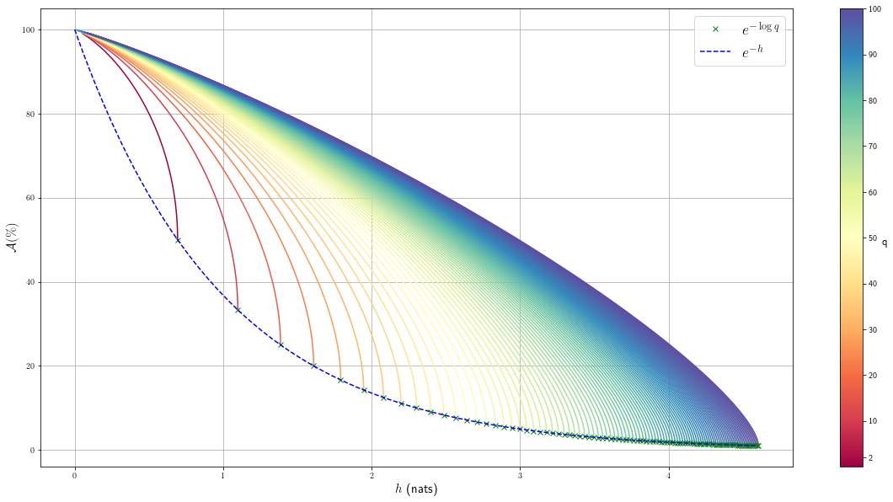

.. meta::
   :description: Introduction of key concepts critical for taking trials and errors out of machine learning projects.
   :keywords: Achievable R^2, Achievable R Squared, Achievable Performance, Model-Free Variable Selection, Model Explanation, Model Audit, KXY, Trial and Error Machine Learning.
   :http-equiv=content-language: en

III - Applications
==================

.. admonition:: Summary

	On this page, we apply the results of `the previous page <quantifying_informativeness.html>`_ to formulate approaches for solving pre-learning and post-learning problems. 

	Specifically, in section :ref:`1 - Achievable Performance` we provide an approach for quantifying the best performance, including :math:`R^2` and classification accuracy, that can be extracted out of a specific set of inputs in a regression or classification problem, irrespective of the model used. 

	Additionally, in section :ref:`2 - Variable Selection Analysis` we introduce a model-free variable selection analysis providing the best :math:`i` inputs to use in a set of :math:`d` inputs, for :math:`i` varying from :math:`1` to :math:`d`, as well as the corresponding best performance (:math:`R^2` and classification accuracy) that can be achieved by any model using these :math:`i` inputs. 

	In section :ref:`3 - Model Improvability` we discuss quantifying the extent to which a trained supervised learning model can be improved without resorting to additional datasets. 

	Finally, in section :ref:`4 - Model Audit` we discuss how to shed some light on the workings of so-called black-box models, and how detect bias in trained supervised learning models.

Throughout this page, we consider the supervised learning problem consisting of predicting label :math:`y` (categorical for classification problems, and continuous for regression problems) using inputs :math:`x = (x_1, \dots, x_d)`. Each input :math:`x_i` can be either continuous or categorical. All entropies and mutual informations are assumed to be known. We discuss model-free maximum entropy estimation of entropies and mutual informations on `the next page <estimation.html>`_.

1 - Achievable Performance
--------------------------

a) Achievable-:math:`R^2`
^^^^^^^^^^^^^^^^^^^^^^^^^

In a regression model :math:`y=f(x) + \epsilon` denoted :math:`\mathcal{M}`, the :math:`R^2` is defined as the fraction of variance of the output :math:`y` that is explained by the regression model:

.. math::

	R^2 \left(\mathcal{M}\right) = 1 - \frac{\mathbb{V}\text{ar}(\epsilon)}{\mathbb{V}\text{ar}(y)} = 1 - \frac{\mathbb{V}\text{ar}\left(y \vert f(x)\right)}{\mathbb{V}\text{ar}(y)}.

The term :math:`\frac{\mathbb{V}\text{ar}\left(y \vert f(x)\right)}{\mathbb{V}\text{ar}(y)}` represents the fraction of variance of the label that cannot be explained using inputs, under our model. 

Although variance is as good a measure of uncertainty as it gets for Gaussian distributions, it is a weak measure of uncertainty for other distributions, unlike the entropy. Considering that the entropy (in nats) has the same unit/scale as the (natural) logarithm of the standard deviation, we generalize the :math:`R^2` as follows:

.. math::

	R^2 \left(\mathcal{M}\right) = 1 - \frac{e^{2h\left(y\vert f(x)\right)}}{e^{2h(y)}} = 1 - e^{-2I\left(y; f(x)\right)}.

Note that when :math:`(y, f(x))` is jointly Gaussian (e.g. Gaussian Process regression, including linear regression, with Gaussian additive noise), the generalized :math:`R^2` above is identical to the original :math:`R^2`. 

This generalized :math:`R^2` applies to both regression and classification problems, linear or nonlinear. Indeed, classification models similarly involve learning a function :math:`f` representing one or multiple separating surfaces, such that the predictive distribution over all possible labels generated by our model takes the form :math:`y|f(x)=*`. In logistic or probit regression for instance, :math:`f(x) = \omega^Tx`.

.. important:: 
	
	**Data Processing Inequality (DPI):** For any function :math:`f`, for any random variables :math:`x` and :math:`y`, :math:`I(x; y) \geq I(f(x); y)`. Moreover, the equality holds when either :math:`f` is invertible or :math:`x` and :math:`y` are independent conditional on :math:`f(x)`, :math:`x \perp y ~\vert~ f(x)`. [[*]_]

It follows from the data processing inequaliy that the maximum :math:`R^2` a supervised learning model can achieve is :math:`\bar{R}^2(x) = 1 - e^{-2I\left(y; x\right)}`. This upper bound is achieved when :math:`x \perp y ~\vert~ f(x)` or, in plain english, when :math:`f(x)` carries all the information about :math:`y` that there is in :math:`x`.

.. admonition:: Definition

	For any supervised learning model :math:`\mathcal{M}`,

	.. math::
		:label: max_r_2

		R^2 \left(\mathcal{M}\right) \leq 1 - e^{-2I\left(y; x\right)} := \bar{R}^2(x).

	We refer to :math:`\bar{R}^2(x)` as the **achievable-** :math:`R^2` using inputs :math:`x`.

.. note::

	The achievable-:math:`R^2` places a hard bound on the performance that can be achieved by any supervised learning model, no matter how deep or fancy. It is solely a function of the mutual information between inputs used and the label :math:`I\left(y; x\right)`, which quantifies how informative inputs are collectively about the label.

	As expected, when inputs are not informative about the label, no model, no matter how fancy, can predict the label. The reverse is also true. There exists a regression model using :math:`x` to predict :math:`y` whose :math:`R^2` is :math:`\bar{R}^2`. [[*]_]

	All we need to estimate the achievable-:math:`R^2` is an estimator for the mutual information :math:`I\left(y; x\right)`, which we will provide on the following page.

b) Achievable True Log-Likelihood
^^^^^^^^^^^^^^^^^^^^^^^^^^^^^^^^^
The *log-likelihood per sample* of a supervised learning model :math:`\mathcal{M}` predicting label :math:`y` from inputs :math:`x` with predictive pdf :math:`p_\mathcal{M}(y|f(x))` is defined for :math:`n` i.i.d. samples :math:`(y_1, x_1), \dots, (y_n, x_n)` as 

.. math::

	\frac{\hat{\mathcal{LL}}}{n} = \frac{1}{n} \sum_{i=1}^n \log p_\mathcal{M}(y_i | f(x) = f(x_i)).

Its population version :math:`\mathcal{LL}\left(\mathcal{M}\right)`, which we call the true log-likelihood per sample, is obtained by taking the expectation with respect to the true data generating distribution, and we have

.. math::

	\mathcal{LL}\left(\mathcal{M}\right) &= E\left( \log p_\mathcal{M}(y | f(x)) \right) \\
										 &\leq E\left( \log p(y | f(x)) \right) \\
				 		   				 &= I(y; f(x)) - h(y) \\
				 		   				 &\leq I(y; x) - h(y) := \bar{\mathcal{LL}}(x),

where :math:`p(y | f(x))` is the true conditional pdf, the first inequality stems from Gibbs' `inequality <https://en.wikipedia.org/wiki/Inequalities_in_information_theory#Gibbs'_inequality>`_ and the second inequality results from applying the DPI.

.. admonition:: Definition

	For any supervised learning model :math:`\mathcal{M}`, the true log-likelihood per sample satisfies

	.. math::
		:label: max_r_2

		\mathcal{LL}\left(\mathcal{M}\right) \leq I(y; x) - h(y) := \bar{\mathcal{LL}}(x).

	We refer to :math:`\bar{\mathcal{LL}}` as the **achievable true log-likelihood per sample** using inputs :math:`x`.

.. note::

	The *achievable true log-likelihood per sample* places a hard bound on the true log-likelihood per sample that can be achieved by any supervised learning model, no matter how deep or fancy. 

	It is solely a function of the mutual information between inputs used and the label :math:`I\left(y; x\right)`, which quantifies how informative inputs are collectively about the label, and the entropy of the :math:`h(y)`, which reflects the true log-likelihood per sample of the naive strategy consisting of always predicting the mode of the distribution of :math:`y`.

	As expected, when inputs are not informative about the label, no model, no matter how fancy, can outperform the naive strategy. The reverse is also true. Indeed, when the model's predictive pdf :math:`p_\mathcal{M}(y|f(x))` is the *true* predictive pdf :math:`p(y|f(x))`, and :math:`y \perp x | f(x)` (i.e. :math:`f(x)` contains all the information about :math:`y` that is in :math:`x`), the inequality is an equality.

c) Achievable Classification Accuracy
^^^^^^^^^^^^^^^^^^^^^^^^^^^^^^^^^^^^^

Entropy And Classification Accuracy
***********************************

First, we want to calculate the best accuracy that can be achieved by predicting an outcome of a discrete distribution taking :math:`q` distinct values, and that has entropy :math:`h(\mathbb{P})`.

We denote :math:`\pi_1, \dots, \pi_q` the probability masses sorted in decreasing order. Faced with predicting an outcome of :math:`\mathbb{P}`, the best strategy is to always predict the most likely outcome. This strategy has accuracy (a.k.a. probability of being correct) :math:`\mathcal{A}(\mathbb{P}) := \underset{i \in [1..q]}{\max} \pi_i = \pi_1`. 

We note that, among all discrete distributions taking :math:`q` distinct values and that have the same highest outcome probability :math:`\pi_1`, the one with the highest entropy is the one whose :math:`(q-1)` least likely outcomes have the same probability (i.e. the most 'spread out' distribution). 

Indeed,

.. math::

	-\pi_1 \log \pi_1 - \sum_{i=2}^q \pi_i \log \pi_i &= -\pi_1 \log \pi_1 + \omega \sum_{i=2}^q \frac{\pi_i}{\omega} \log \frac{1}{\pi_i} \\
							                          &\leq -\pi_1 \log \pi_1 + \omega \log \sum_{i=2}^q \frac{\pi_i}{\omega} \frac{1}{\pi_i} \\
							                          &= -\pi_1 \log \pi_1 + \omega \log \frac{q-1}{\omega} \\
							                          &= -\pi_1 \log \pi_1 -(q-1) \frac{\omega}{q-1}\log \frac{\omega}{q-1}

where :math:`\omega = \sum_{i=2}^q \pi_i`. The inequality above is a direct application of `Jensen's inequality <https://en.wikipedia.org/wiki/Jensen%27s_inequality>`_ to the (convex) the logarithm function, and the equality holds if and only if all :math:`\pi_i` are the same for :math:`i \geq 2` and equal to :math:`\frac{\omega}{q-1}`.

A corollary of the foregoing result is that, among all discrete distributions taking :math:`q` distinct values and that have the same entropy, 
if there is one whose :math:`(q-1)` least likely outcomes have the same probability, then its highest outcome probability is the largest of them all. 

We complement this result by showing that for any possible value :math:`h` of the entropy of a discrete distribution taking :math:`q` distinct values, there exists a discrete distribution whose entropy is :math:`h` and whose :math:`(q-1)` least likely outcomes have the same probability. 

All possible values for :math:`h` lie in :math:`[0, \log q]`. [[*]_] Let us denote :math:`\bar{h}_q(a)` the entropy of a discrete distribution whose most likely outcome has probability :math:`a`, and whose :math:`(q-1)` least likely outcomes have the same probability:

.. math::

	\bar{h}_q(a) = -a \log a -(1-a) \log \left(\frac{1-a}{q-1}\right), ~~~~ a \geq \frac{1}{q}.

A simple study of the function :math:`a \to \bar{h}_q(a)` shows that it is differentiable, decreasing, concave, and invertible on :math:`\Big[\frac{1}{q}, 1\Big]`, and the image of :math:`\Big[\frac{1}{q}, 1\Big]` is :math:`[0, \log q]`; which is what we needed to show.

Putting everything together, for a given entropy :math:`h` the best accuracy that can be achieved by predicting an outcome of any discrete distribution taking :math:`q` distinct values, and that has entropy :math:`h` is given by

.. math::

	\mathcal{A}(h) := \bar{h}_q^{-1}(h),

where the function :math:`h \to \bar{h}_q^{-1}(h)` is the inverse of the function :math:`a \to \bar{h}_q(a)` and is easily evaluated numerically.

.. admonition:: Important Equation

	.. math::

		\mathcal{A}(\mathbb{P}) \leq \bar{h}_q^{-1}\left(h(\mathbb{P})\right)

The figure below illustrates the bound for :math:`q` ranging between :math:`2` and :math:`100`. 

	Fig 1. Accuracy achievable in predicting the outcome of a discrete distribution with q possible outcomes.

Conditional Entropy and Predictive Accuracy
*******************************************
We apply the result above to classification models. Faced with predicting :math:`y` given a specific value of :math:`x=*`, the best prediction is the outcome 

.. math::

	j = \underset{i \in [1..q]}{\operatorname{argmax}} \mathbb{P}(y=i | x=*)

and it has accuracy :math:`\mathbb{P}(y=j | x=*)`, where :math:`y|x=*` is the *true* data generating conditional distribution. Any other prediction :math:`i` would, by definition of :math:`j`, have a lower accuracy :math:`\mathbb{P}(y=i | x=*)`. 

The best possible overall accuracy a model can achieve is therefore

.. math::

	\mathcal{A}^* = E\left[\underset{i \in [1..q]}{\operatorname{max}} \mathbb{P}(y=i | x=*)\right],

where the expectation is taken under the *true* data generating distribution of :math:`x`. 

For a model to achieve maximum accuracy, all that is needed is for its most likely outcome to coincide with that of :math:`y|x=*` for every value :math:`x=*`. Among all such models, there is the *true* data generating predictive distribution :math:`* \to y|x=*`, which is the maximum-accuracy model that has the lowest cross-entropy loss as discussed in the previous section.

Another maximum-accuracy model is the model whose predictive distribution has the same entropy as that of the previously mentioned model, namely :math:`h(y|x=*)` and, of course, whose outcome with the highest probability is the same as that of :math:`y|x=*`. [[*]_] 

It follows from the previous analysis that its highest outcome probability is greater than or equal to the model accuracy (which is the highest outcome probability of the distribution :math:`y|x=*` which has the same entropy),

.. math::
	
	\bar{h}_q^{-1}\left(h(y|x=*)\right) \geq  \underset{i \in [1..q]}{\operatorname{max}} \mathbb{P}(y=i | x=*),

with equality when the *true* data generating predictive distribution happens to make no distinction between the :math:`(q-1)` least likely outcomes. Additionally, it follows from the concavity of :math:`\bar{h}_q^{-1}` that

.. math::

	\mathcal{A}^* & \leq E\left[\bar{h}_q^{-1}\left(h(y|x=*)\right)\right] \\
		          & \leq \bar{h}_q^{-1}\left(h(y|x)\right) \\
		          &= \bar{h}_q^{-1}\left( h(y)-I(y; x)\right),

where the second inequality is an equality when the entropy of the *true* data generating predictive distribution :math:`h(y|x=*)` doesn't vary much over the domain.

.. admonition:: Definition

	For any classification model :math:`\mathcal{M}` using inputs :math:`x` to predict label :math:`y`, and that has accuracy :math:`\mathcal{A}\left(\mathcal{M}\right)`, we have

	.. math::
		:label: best_acc

		\mathcal{A}\left(\mathcal{M}\right) \leq \bar{h}_q^{-1}\left( h(y)-I(y; x)\right) := \bar{\mathcal{A}}(x). 

	We refer to  :math:`\bar{\mathcal{A}}(x)` as the **achievable classification accuracy** using inputs :math:`x`.

.. note::

	The achievable classification accuracy places a hard bound on the accuracy that can be achieved by any classification model, no matter how deep or fancy. It is solely a function of the mutual information between inputs used and the label :math:`I\left(y; x\right)`, which quantifies how informative inputs are collectively about the label, and the entropy of the :math:`h(y)`, which reflects the accuracy of the naive strategy consisting of always predicting the most frequent outcome :math:`j = \underset{i \in [1..q]}{\operatorname{argmax}} \mathbb{P}(y=i)`.

	As expected, when inputs are not informative about the label, no model, no matter how fancy, can outperform the naive strategy. The reverse is true when inputs are chosen so that for every value :math:`x=*` the *true* data generating conditional distribution :math:`y|x=*` places the same probability mass on all :math:`(q-1)` least likely outcome (i.e. there is no clear second-best), and when the *true* predictive entropies :math:`h(y|x=*)` are the same across the domain (i.e. inputs are not much more informative about the label in certain regions of the domain than others).

d) Regression Achievable-RMSE
^^^^^^^^^^^^^^^^^^^^^^^^^^^^^

In a regression model :math:`y=f(x) + \epsilon` denoted :math:`\mathcal{M}`, the Root Mean Squared Error (RMSE) is defined as the square root of the mean of the squared error:

.. math::

	RMSE \left(\mathcal{M}\right) &= \sqrt{E\left[\left(y-f(x)\right)^2 \right]} \\
								  &= \sqrt{\mathbb{V}\text{ar}\left(y \vert f(x)\right) + \left[E\left(y-f(x)\right)\right]^2} \\
								  &= \sqrt{\mathbb{V}\text{ar}\left(y\right)} \sqrt{\frac{\mathbb{V}\text{ar}\left(y \vert f(x)\right)}{\mathbb{V}\text{ar}\left(y\right)} + \frac{\left[E\left(y-f(x)\right)\right]^2}{\mathbb{V}\text{ar}\left(y\right)}}.

Following the same reasoning as for the achievable-:math:`R^2`, we generalize the ratio :math:`\frac{\mathbb{V}\text{ar}\left(y \vert f(x)\right)}{\mathbb{V}\text{ar}\left(y\right)}` by replacing it by :math:`e^{-2I\left(y; f(x)\right)}`. We obtain

.. math::

	RMSE \left(\mathcal{M}\right) = \sqrt{\mathbb{V}\text{ar}\left(y\right)} \sqrt{e^{-2I\left(y; f(x)\right)} + \frac{\left[E\left(y-f(x)\right)\right]^2}{\mathbb{V}\text{ar}\left(y\right)}}.

Note that when :math:`(y, f(x))` is jointly Gaussian (e.g. Gaussian Process regression, including linear regression with Gaussian additive noise), the generalized RMSE above is identical to the original RMSE. It follows from the data processing inequaliy that the smallest RMSE any regression model can achieve is :math:`\bar{RMSE}(x) = e^{-I\left(y; x\right)} \sqrt{\mathbb{V}\text{ar}\left(y\right)}`. This lower bound is reachable (for example when :math:`f(x)=E(y|x)`).

.. admonition:: Definition

	For any regression model :math:`\mathcal{M}`,

	.. math::
		:label: min_rmse

		RMSE \left(\mathcal{M}\right) \geq e^{-I\left(y; x\right)} \sqrt{\mathbb{V}\text{ar}\left(y\right)} := \bar{RMSE}(x).

	We refer to :math:`\bar{RMSE}(x)` as the **achievable-RMSE** using inputs :math:`x`.

.. note::

	The achievable-RMSE places a hard bound on the performance that can be achieved by any regression model, no matter how deep or fancy. It is solely a function of the mutual information between inputs used and the label :math:`I\left(y; x\right)`, which quantifies how informative inputs are collectively about the label, and the output standard deviation, which is the RMSE of the naive strategy consisting of always predicting :math:`E(y)`.

	As expected, when inputs are not informative about the label, no model, no matter how fancy, can do better than the naive benchmark consisting of always predicting the mean output :math:`f(x) = E(y)`.

	All we need to estimate the achievable-RMSE is an estimator for the mutual information :math:`I\left(y; x\right)`, which we will provide on the following page.

2 - Variable Selection Analysis
-------------------------------
We consider a supervised learning problem consisting of predicting label :math:`y`. There are :math:`d` candidate inputs or variables, namely :math:`x = (x_1, \dots, x_d)`, that we could use to do so, and our aim is to quantify the maximum value every one of them could bring to the table.

We proceed in two steps components. First, we analyze the value that can be generated by using each candidate input :math:`x_i` in isolation to predict our label :math:`y`.

a) Univariate Variable Importance
^^^^^^^^^^^^^^^^^^^^^^^^^^^^^^^^^
By applying the results of the section :ref:`1 - Achievable Performance` to each input in isolation, we are able to compute the highest performance or lowest loss that can be achieved by using each input in isolation.

* **Univariate Achievable-**:math:`R^2`: The highest :math:`R^2` that can be achieved by any model solely using input :math:`x_i` is given by 

.. admonition:: Important Equation

	.. math::
		:label: uni_r_2

		\bar{R}^2(x_i) := 1-e^{-2I(y; x_i)}.

* **Univariate Achievable-RMSE**: The smallest RMSE that can be achieved by any model solely using input :math:`x_i` is given by 

.. admonition:: Important Equation

	.. math::
		:label: uni_rmse

		\bar{R}^2(x_i) := e^{-I(y; x_i)} \sqrt{\mathbb{V}\text{ar}\left(y\right)}.

* **Univariate Achievable True Log-Likelihood Per Sample:** The highest true log-likelihood per sample that can be achieved by any supervised learning model solely using :math:`x_i` is given by

.. admonition:: Important Equation

	.. math::
		:label: uni_log_lik

		\bar{\mathcal{LL}}(x_i) :=  I(y; x_i)-h(y).

* **Univariate Achievable Classification Accuracy:** For classification problems, the highest accuracy that can be achieved by any classification model solely using input :math:`x_i` is given by

.. admonition:: Important Equation

	.. math::
		:label: uni_acc

		\bar{\mathcal{A}}(x_i) := \bar{h}_q^{-1}\left(h(y)-I(y; x_i)\right).

b) Marginal Variable Importance
^^^^^^^^^^^^^^^^^^^^^^^^^^^^^^^
The univariable variable importance analysis above does not paint the full picture. 

Some inputs/variables might be redundant. Redundant variables could cause model training to be less robust, for instance because of ill-conditioning. Redundant variables could also artificially increase model complexity, for instance when it is directly related to the number of inputs/variables, without increasing the effective number of variables. This could result in overfitting, longer model training times, and a waste of computating resources. Finally, when datasets are acquired, redundant datasets are a waste of money.

Complementary inputs/variables are the flip side of redundant inputs. They provide the highest marginal value added, make model training more robust, yield an efficient number of variables and mitigate overfitting and computing resource waste, and overall generate a high ROIs.

As previously discussed, whether we use the :math:`R^2`, the classification cross-entropy loss, or the classification accuracy, the overall value that can be generated by using all inputs :math:`x = (x_1, \dots, x_d)` collectively to predict :math:`y`, is a function of the mutual information :math:`I(y; x)`.

Selection Order
***************
For every permutation :math:`\{\pi_1,  \dots,  \pi_d\}` of :math:`\{1, \dots, d\}` we have 

.. math::
	:label: tower_law

	I(y; x) = I\left(y; x_{\pi_1}\right) + \sum_{i=2}^d I\left(y; x_{\pi_i} | x_{\pi_{i-1}}, \dots, x_{\pi_1}\right).

:math:`I\left(y; x_{\pi_1}\right)` reflects the maximum value that variable :math:`x_{\pi_1}` can bring to the supervised learning problem, whereas :math:`I\left(y; x_{\pi_i} | x_{\pi_{i-1}}, \dots, x_{\pi_1}\right)` reflects the maximum *marginal* or *incremental* value that variable :math:`x_{\pi_i}` can bring over the variables :math:`x_{\pi_{i-1}}, \dots, x_{\pi_1}`.

To rank variables by decreasing order of marginal value added, we proceed as follows:

* The first input/variable selected is the one with the highest mutual information with the label, or said differently, the input that is the most valuable when used in isolation to predict the label:

.. admonition:: Important Equation

	.. math::
		:label: select_1

		\pi_1 = \underset{j \in [1..d]}{\operatorname{argmax}} I(y ; x_j).

* The :math:`(i+1)`-th input/variable selected is the one, among all remaining :math:`d-i` inputs that haven't yet been selected, that has the highest mutual information with the label *conditional on all inputs previously selected*, or said differently, the input that complements the :math:`i` previous selected inputs the most:

.. admonition:: Important Equation

	.. math::
		:label: select_i
		
		\pi_{i+1} = \underset{j \in [1..d], ~~ j \notin \{\pi_1, \dots, \pi_i\}}{\operatorname{argmax}} I\left(y ; x_j | x_{\pi_{i}}, \dots, x_{\pi_1}\right).

Maximum Marginal :math:`R^2` Increase
*************************************
The maximum contribution of :math:`\pi_1` to the achievable-:math:`R^2` is simply :math:`\bar{R}^2(x_{\pi_1})`. 

The maximum contribution of :math:`\pi_{i+1}` to the achievable-:math:`R^2` is the difference between the achievable-:math:`R^2` using the first :math:`(i+1)` inputs selected and the achievable-:math:`R^2` using the first :math:`i` inputs selected. It reads:

.. admonition:: Important Equation

	.. math::
		:label: marg_r_2
		
		\bar{R}^2\left( x_{\pi_1}, \dots, x_{\pi_{i+1}} \right) - \bar{R}^2\left( x_{\pi_1}, \dots, x_{\pi_i} \right) &= e^{-2I\left(y; x_{\pi_1}, \dots, x_{\pi_i}\right)} - e^{-2I\left(y; x_{\pi_1}, \dots, x_{\pi_{i+1}}\right)} \\
		                                                                                                              &= \bar{R}^2\left( x_{\pi_1}, \dots, x_{\pi_i} \right) \left[1- e^{-2I\left(y; x_{\pi_{i+1}} | x_{\pi_1}, \dots, x_{\pi_i}\right)} \right].

Note that, as expected, the achievable-:math:`R^2` can never decrease as a result of adding an input. Additionally, it would only increase if the conditional mutual information :math:`I\left(y; x_{\pi_{i+1}} | x_{\pi_1}, \dots, x_{\pi_i}\right)` is strictly positive, meaning :math:`x_{\pi_{i+1}}` is not redundant in light of :math:`x_{\pi_1}, \dots, x_{\pi_i}`. The higher the conditional mutual information the more complementary value the new input is expected to add.

Maximum Marginal RMSE Decrease
******************************
Following the same reasoning as for the :math:`R^2`, we obtain 

.. admonition:: Important Equation

	.. math::
		:label: marg_rmse
		
		\bar{RMSE}\left( x_{\pi_1}, \dots, x_{\pi_i} \right) - \bar{RMSE}\left( x_{\pi_1}, \dots, x_{\pi_{i+1}} \right) &= \left[e^{-I\left(y; x_{\pi_1}, \dots, x_{\pi_i}\right)} - e^{-I\left(y; x_{\pi_1}, \dots, x_{\pi_{i+1}}\right)}\right]\sqrt{\mathbb{V}\text{ar}\left(y\right)} \\
		                                                                                                              &= \bar{RMSE}\left( x_{\pi_1}, \dots, x_{\pi_i} \right) \left[1- e^{-I\left(y; x_{\pi_{i+1}} | x_{\pi_1}, \dots, x_{\pi_i}\right)} \right].

Maximum Marginal True Log-Likelihood Per Sample Increase 
********************************************************
The maximum contribution of :math:`\pi_1` to the achievable true log-likelihood per sample is simply :math:`\bar{LL}(x_{\pi_1})`. 

The maximum contribution of :math:`\pi_{i+1}` to the achievable true log-likelihood per sample is the difference between the achievable true log-likelihood per sample using the first :math:`(i+1)` inputs selected and the achievable true log-likelihood per sample using the first :math:`i` inputs selected. It reads:

.. admonition:: Important Equation

	.. math::
		:label: marg_log_lik
		
		\bar{\mathcal{LL}}\left( x_{\pi_1}, \dots, x_{\pi_{i+1}} \right) - \bar{\mathcal{LL}}\left( x_{\pi_1}, \dots, x_{\pi_{i}} \right) = I\left(y; x_{\pi_{i+1}} | x_{\pi_1}, \dots, x_{\pi_i}\right).

Once again, as expected, the achievable true log-likelihood per sample never decreases as a result of adding an input. Additionally, it would only increase if the conditional mutual information :math:`I\left(y; x_{\pi_{i+1}} | x_{\pi_1}, \dots, x_{\pi_i}\right)` is strictly positive, meaning :math:`x_{\pi_{i+1}}` is not redundant in light of :math:`x_{\pi_1}, \dots, x_{\pi_i}`. The higher the conditional mutual information the more complementary value the new input is expected to add.

Maximum Marginal Classification Accuracy Increase
*************************************************
The same logic can be used to calculate the maximum contribution of any input to achievable classification accuracy using :math:`\bar{\mathcal{A}}(x)`. We will not discuss this any further as the interpretation is not as straightforward as for the previous two metrics.

3 - Model Improvability
-----------------------
Once a model has been learned, it is important to get a sense for whether it could be improved without resorting to additional inputs, and if so, to what extent.

a) Suboptimality
^^^^^^^^^^^^^^^^

Absolute Suboptimality
**********************
Let us consider a model :math:`\mathcal{M}` predicting that the label :math:`y` associated to :math:`x` is :math:`f(x)`. As previously discussed, :math:`I\left(f(x); y\right)` reflects how accurate :math:`\mathcal{M}` is, and, by the data processing inequality, the highest possible value for :math:`I\left(f(x); y\right)` is :math:`I\left(x; y\right)`. Thus,

.. admonition:: Important Equation

	.. math::
		:label: subopt

		SO(\mathcal{M}) :&= I(x; y)-I\left(f(x); y\right) \\
						 &= I(x; y | f(x))

is a natural measure of how suboptimal :math:`\mathcal{M}` is. Note that, using :math:`SO`, :math:`\mathcal{M}` is optimal if and only if :math:`x` and :math:`y` are statistically independent conditional on :math:`f(x)`, meaning that :math:`f(x)` fully captures everything there is in :math:`y` about :math:`x`, and as such :math:`\mathcal{M}` cannot be improved.

.. note::
	In regression problems, it is worth noting that, because :math:`SO(\mathcal{M})=0` (or equivalently because :math:`x` and :math:`y` are statistically independent conditional on :math:`f(x)`) doesn't necessarily mean that :math:`\mathcal{M}` is the most accurate regression model using :math:`x` to predict :math:`y` there can be. 

	It means that the most accurate model there is can be derived from :math:`f(x)`. In other words, the regression model didn't lose any of the information in :math:`x` pertaining to :math:`y`, and we are a univariate regression away from the most accurate model.

Additive Suboptimality
**********************
As previously discussed, :math:`SO` is a weak optimality criteria for regression problems in that an :math:`SO`-optimal model needs not be the most accurate. 

To address this limitation, we consider the following additive regression model

.. math::

	y = f_1(x) + \epsilon_1.

As long as :math:`\epsilon_1` can be predicted using :math:`x`, the regression model above can be improved by solving the regression problem :math:`\epsilon_1 = f_2(x) + \epsilon_2`. More generally, so long as :math:`\epsilon_{k-1}` can be predicted using :math:`x`, by solving the regression problem :math:`\epsilon_{k-1} = f_k(x) + \epsilon_k`, the regression model 

.. math::

	y = \sum_{i=1}^k f_i(x) + \epsilon_k

will outperform the previous regression model :math:`y = \sum_{i=1}^{k-1} f_i(x) + \epsilon_{k-1}`, which itself outperforms the original regression model.

Along this line, we introduce the **additive suboptimality score**

.. admonition:: Important Equation

	.. math::

		ASO(\mathcal{M}) := I(y-f(x); x).

We note that

.. math::

	ASO(\mathcal{M}) &= I(y-f(x); x) \\
					 &= \underbrace{h(y-f(x))}_{h(\epsilon)} - h(y-f(x)|x) \\
					 &= h(\epsilon) - h(y|x) \\
					 &= h(\epsilon) - h(y) + I(y|x) \\
					 &= h(\epsilon) - h(y) + I\left(f(x); y\right) + SO(\mathcal{M}) \\
					 &= h(\epsilon) - h\left(y|f(x)\right) + SO(\mathcal{M}) \\
					 &= h(\epsilon) - h\left(\epsilon |f(x)\right) + SO(\mathcal{M}) \\
					 &= I(\epsilon; f(x)) + SO(\mathcal{M}).

Hence, 

.. math::
	:label: aso_and_so

	ASO(\mathcal{M}) &=  \underbrace{SO(\mathcal{M})}_{\text{Information Loss Penalty}} + \underbrace{I(y-f(x); f(x))}_{\text{Additive Penalty}} \\
					 &\geq SO(\mathcal{M}).

.. note::

	Additive suboptimality enforces two requirements. Through :math:`SO(\mathcal{M})`, it requires the model to capture in :math:`f(x)` as much of the information about :math:`y` that is in :math:`x` as possible. Through :math:`I(y-f(x); f(x))` it requires residuals to be as independent as possible from predictions or, said differently, it requires the model to be accurate or at least hard to improve in an additive fashion.

	Reducing :math:`ASO` to zero ensures that, not only can we no longer improve our regression model additively, but we have exploited all the insights in :math:`x` about :math:`y`.

	

b) Lost Performance
^^^^^^^^^^^^^^^^^^^
Once more, let us consider a model :math:`\mathcal{M}` predicting that the label :math:`y` associated to :math:`x` is :math:`f(x)`. Lost performance is the flip side of achievable performance. 

Essentially, what could be achieved in predicting :math:`y` with :math:`x` minus what could be achieved in predicting :math:`y` with our trained model's prediction :math:`f(x)` constitutes what has been lost by our model when turning :math:`x` into :math:`f(x)`.

Lost :math:`R^2`
****************
The highest :math:`R^2` that can be achieved in predicting :math:`y` with :math:`x` is the achievable-:math:`R^2` :math:`\bar{R}^2(x) = 1-e^{-2I(y;x)}`, and the highest :math:`R^2` that can be achieved in predicting :math:`y` with :math:`f(x)` is :math:`R^2(\mathcal{M}) = 1-e^{-2I(y;f(x))}`.

Taking the difference, we get the **lost** :math:`R^2`:

.. math::

	\bar{R}^2(x) - R^2(\mathcal{M}) &= e^{-2I(y;f(x))} \left[1 - e^{-2 \left[I(y;x)-I(y;f(x)) \right]} \right] \\
												 &= e^{-2I(y;f(x))} \left[1 - e^{-2 SO(\mathcal{M})}\right].

.. admonition:: Important Equation

	.. math::
		:label: lo_r2

		\bar{R}^2(x) - R^2(\mathcal{M}) = e^{-2I(y;f(x))} \left[1 - e^{-2 SO(\mathcal{M})}\right]

As expected, the suboptimality score SO plays a key role in the amount of :math:`R^2` lost. Specifically, there is always :math:`R^2` lost, unless the trained model is optimal (i.e. :math:`SO(\mathcal{M}) = 0`). 

The more suboptimal the trained model is, the more :math:`R^2` was lost by the model.

Excess RMSE
***********
The smallest RMSE that can be achieved in predicting :math:`y` with :math:`x` is the achievable-RMSE :math:`\bar{RMSE}(x) = e^{-I(y;x)}\sqrt{\mathbb{V}\text{ar}\left(y\right)}`, and the smallest RMSE that can be achieved by predicting :math:`y` with :math:`f(x)` is :math:`RMSE(\mathcal{M}) = e^{-I\left(y;f(x)\right)}\sqrt{\mathbb{V}\text{ar}\left(y\right)}`.

Taking the difference, we get the **Excess RMSE**:

.. math::

	RMSE(\mathcal{M}) - \bar{RMSE}(x) &= e^{-I(y;f(x))} \sqrt{\mathbb{V}\text{ar}\left(y\right)} \left[1 - e^{- \left[I(y;x)-I(y;f(x)) \right]} \right] \\
												 &= RMSE(\mathcal{M}) \left[1 - e^{-SO(\mathcal{M})}\right].

.. admonition:: Important Equation

	.. math::
		:label: exc_rmse

		\bar{RMSE}(x) - RMSE(\mathcal{M}) = RMSE(\mathcal{M}) \left[1 - e^{-SO(\mathcal{M})}\right]

Lost True Log-Likelihood Per Sample
***********************************
The highest true log-likelihood per sample that can be achieved in predicting :math:`y` with :math:`x` is :math:`\bar{\mathcal{LL}}(x) = I(y; x)-h(y)`, and the highest true log-likelihood per sample that can be achieved in predicting :math:`y` with :math:`f(x)` is :math:`\mathcal{LL}(\mathcal{M}) = I(y; f(x))-h(y)`.

Taking the difference, we get that the **true log-likelihood per sample lost** is simply the suboptimality score.

.. admonition:: Important Equation

	.. math::
		:label: lo_log_lik

		\bar{\mathcal{LL}}(x) - \mathcal{LL}(\mathcal{M}) = SO(\mathcal{M})

Once more, as expected, the suboptimality score SO plays a key role in the amount of true log-likelihood per sample lost. Specifically, some true log-likelihood per sample is always lost, unless the trained model is optimal (i.e. :math:`SO(\mathcal{M}) = 0`). The more suboptimal the trained model is, the more log-likelihood per sample the model would not have captured that it could.

Lost Classification Accuracy
****************************
Extension of the analysis above to classification accuracy is trivial. The best accuracy that can be achieved in predicting :math:`y` with :math:`x` is :math:`\bar{\mathcal{A}}(x) = \bar{h}_q^{-1}\left( h(y)-I(y; x)\right)`, and the accuracy achieved by model :math:`\mathcal{M}` does not exceed :math:`\mathcal{A}(\mathcal{M}) = \bar{h}_q^{-1}\left( h(y)-I(y; f(x))\right)`.

Thus the **accuracy loss** by model :math:`\mathcal{M}` is at least

.. admonition:: Important Equation

	.. math::
		:label: lo_acc

		\bar{\mathcal{A}}(x) - \mathcal{A}(\mathcal{M}) = \bar{h}_q^{-1}\left( h(y)-I(y; x)\right) - \bar{h}_q^{-1}\left( h(y)-I(y; f(x))\right).

c) Regression Residual Performance
^^^^^^^^^^^^^^^^^^^^^^^^^^^^^^^^^^
For regression problems, we define residual performance as the maximum performance that can be achieved when trying to predict regression residuals with the same inputs. A high residual performance is an indication that the model can be improved additively (i.e. by focusing on predicting its residuals).

Residual :math:`R^2`
********************

The residual :math:`R^2` reads

.. admonition:: Important Equation

	.. math::
		:label: res_r_2

		\text{Residual-}R^2\left(\mathcal{M}\right) &= 1-e^{-2I(y-f(x); x)} \\
															 &= 1-e^{-2\text{ASO}(\mathcal{M})}.

Residual RMSE
**************

The residual RMSE reads

.. admonition:: Important Equation

	.. math::
		:label: res_rmse

		\text{Residual-RMSE}\left(\mathcal{M}\right) &= e^{-I(y-f(x); x)} \sqrt{\mathbb{V}\text{ar}\left(y-f(x)\right)}  \\
															 &= e^{-\text{ASO}(\mathcal{M})}\sqrt{\mathbb{V}\text{ar}\left(y-f(x)\right)}.

Residual Log-Likelihood
***********************

Similarly, the residual true log-likelihood per sample reads

.. admonition:: Important Equation

	.. math::
		:label: res_ll

		\text{Residual-}\mathcal{LL}\left(\mathcal{M}\right) &= h\left(y-f(x) \right)-I(y-f(x); x) \\
															  &= h\left(y-f(x) \right)-\text{ASO}(\mathcal{M}).

Note that :math:`h\left(y-f(x) \right)` is the log-likelihood per sample of the naive strategy consisting of predicting the mode of true unconditional residual distribution.

4 - Model Audit
---------------
As usual, we consider a model :math:`\mathcal{M}` predicting that the label :math:`y` associated to :math:`x` is :math:`f(x)`. 

a) Model Explanation
^^^^^^^^^^^^^^^^^^^^
The natural inclination for studying a trained supervised learning model, especially regression models, is to mathematically study the function :math:`x \to f(x)`, for instance by evaluating its gradient, Hessian or its integral over all but one input/variable. 

Not only is this approach tedious, but it does not apply all models. For instance, some inputs might be categorical in regression models, or in classification models :math:`f(x)` would represent the categorical predicted label, and in both cases there is no smooth surface to take the gradient or hessian of. Even when the function :math:`x \to f(x)` defines a smooth surface, it might not be available analytically (e.g. Gaussian process models). Even when it is available analytically, some mathematical operations could be analytically intractable and numerically impractical (e.g. computing large dimensional integrals to gauge marginal effects).

We resort to an information-theoretical alternative approach that is very flexible and yet requires nothing but the ability to evaluate the trained model at any input :math:`x`, and applies to both categorical and continuous inputs, classification and regression problems, smooth or otherwise. 

Specifically, while quantifying the suboptimality of :math:`\mathcal{M}` boils down to studying the structures in the distribution :math:`(y, f(x))`, explaining the model :math:`\mathcal{M}` could be done by studying the structures in the distribution :math:`(x, f(x))`. Critically though, unlike in the suboptimality analysis, we are only interested in understanding how the model arrives at its decisions, and what decisions it would make in certain scenarios. We are not interested in dissecting model accuracy; this is done in the suboptimality analysis. Thus, our analysis has no bearing on the *true* data generating distribution of :math:`y`.

If we define :math:`y_p := f(x)` then we may reuse the variable selection analysis of section :ref:`2 - Variable Selection Analysis` to quantify the influence each input/variable :math:`x_i` has on the model :math:`\mathcal{M}`, replacing :math:`y` by :math:`y_p`. As for what distribution to use for inputs :math:`x`, the flexibility of this approach lies in the fact that it all depends on the scenario in which we want to make sense of our model's decisions.

To make sense of our model decisions by focusing on inputs that are likely to arise in real life, we would choose as distribution for :math:`x` the *true* data generating distribution (i.e. get samples of :math:`x` from real-life observations, and generate corresponding samples of :math:`y_p` by running our model on collected inputs). In general, however, we need not rely on, or be constrained by, the *true* data generating distribution.

Stress tests and scenario analyses are easily performed by choosing as distribution for :math:`x` one that reflects the conditions of scenario. Whether it is fixing the values of certain categorical inputs, or requiring certain continuous inputs to take values in specific intervals (e.g. extreme values), all these scenarios can be expressed as distributions of :math:`x`, often times uniform on some domain, which we can generate i.i.d. samples from. 

Performing our variable selection analysis will then inform us on the influence each input/variable has on the model decisions in the specific scenario of interest, either in isolation or in conjunction with other variables.

b) Quantifying Bias in Models
^^^^^^^^^^^^^^^^^^^^^^^^^^^^^
The ability to spot biases in trained machine learning models is increasingly important, as society becomes more and more `AI-powered`. 

Detecting Bias
**************
Detecting bias could be done by determining whether the category variable :math:`z`, upon which bias or discrimination could be based (e.g. race, gender, income level, etc.), has any implicit bearing on decision making, or decision making is oblivious to it. 

As usual, this could be done by computing the mutual information between model predictions :math:`y_p=f(x)` and :math:`z` under the *true* data generating distribution

.. admonition:: Important Equation

	.. math::
		:label: bias

		Bias(\mathcal{M}; z) = I(z; y_p).

For :math:`z` to have no bearing on :math:`\mathcal{M}`, or for :math:`\mathcal{M}` to be oblivious to :math:`z`, :math:`Bias(\mathcal{M}; z)` should be as close to :math:`0` as possible.

Bias Source
***********
Often times, models will not directly make use of the category variable :math:`z`, for legal or ethical reasons. In such an instance, to fix the bias, it is important to understand which inputs implicitly induced it. This could be done by comparing the overall impact of each input :math:`x_i` on the decision :math:`y_p` to its impact on :math:`y_p` for a specific group :math:`z=j`. Assuming :math:`z` can take up to :math:`q` distinct values, we introduce the :math:`d \times q` bias-source matrix

.. admonition:: Important Equation

	.. math::

		BiasSource(\mathcal{M}; z)[i, j] :=  \left\vert I(x_i; y_p) - I(x_i; y_p | z=j) \right\vert.

If :math:`BiasSource(\mathcal{M}; z)[i, j]` is not close to :math:`0`, the data scientist should ask herself whether it is fair or ethical to treat individuals in group :math:`j` differently from another individual with the same input characteristic :math:`x_i` but in another group. 

If the answer is no, then chances are that the empirical distribution :math:`(x_i, y) | z=j`, as per the training dataset, was not representative of the true data generating distribution :math:`(x_i, y)`, in which case the data scientist should consider collecting additional samples from group :math:`j`.

.. rubric:: References

.. [1] Cover, T.M. and Thomas, J.A., 2012. Elements of information theory. John Wiley & Sons.

.. rubric:: Footnotes

.. [*] Hint: The data processing inequality is well documented for categorical distributions. See for instance, Theorem 2.8.1 in [[1]_] and its corollary. For continuous and mixed distributions, use the Definition (8.54) in [[1]_], apply the data processing inequality to the quantized distributions, and take the supremum.

.. [*] To see why, let's consider the most general form of regression models, given by the graphical model :math:`x \to z`. The random variable :math:`z` is the prediction of :math:`y` we form after observing :math:`x`. Such a model has :math:`R^2` equal to :math:`1 - e^{-2I\left(y; z\right)}` as discussed above. When :math:`z` has the same distribution as the true data generating conditional distribution :math:`y|x`, our model achieves maximum :math:`R^2`.

.. [*] The uniform distribution is maximum entropy and has entropy :math:`\log q`, the entropy of a distribution with only one outcome with non-null probability is :math:`0`, and Shannon's entropy is non-negative.

.. [*] As previously proved, for any entropy :math:`h` we can always find a distribution whose :math:`(q-1)` least likely outcomes always have the same probability.

.. [*] True in the sense that :math:`(y, x)` is the true data generating distribution.

