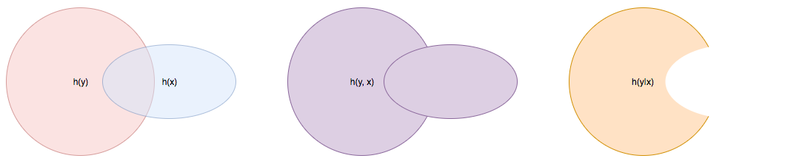

.. meta::
	:description: A primer on information theory and copulas for quantifying informativeness and associations.
	:keywords:  Information Theory Tutorial, Information Theory Primer, Copula-Uniform Dual, Copulas
	:http-equiv=content-language: en

II - Quantifying Informativeness
================================

.. admonition:: Summary

	On this page, we provide a primer on information theory. 

	Specifically, in section :ref:`1 - Quantifying Information` we introduce the notions of Shannon, differential and mixed entropies, and we provide an intuition for why they are good measures of *information content* or *uncertainty*. 

	In section :ref:`2 - Association and Copula` we introduce *copulas*, we discuss their importance for *modeling associations*, and we provide a fundamental identity relating the entropy of a random vector to the entropy of its copula and the entropies of its marginals. 

	Finally, in section :ref:`3 - Quantifying Association` we introduce Shannon, differential and mixed mutual informations, we discuss their importance for *quantifying associations* between random variables, and we provide fundamental identities relating the differential or mixed mutual informations between two random variables and the associated copulas. In particular, we show that the differential mutual information between two random variables does not depend on their marginals.

Whether in the pre-learning or post-learning phase, a key to success is the ability to quantify how informative a vector of inputs :math:`x` is about a label of :math:`y`. :math:`x` can either be categorical, continuous, or have both categorical and continuous coordinates. :math:`y` can either be continuous (in regression problems) or categorical (in classification problems).

As usual, we express our lack of knowledge and in-depth understanding about the dynamics of the phenomena giving rise to our inputs and/or label as randomness, and we model the inputs vector :math:`x` and the label :math:`y` as random variables. 

Our approach to quantifying the information content of a random variable and how informative one random variable is about another is routed in `information theory <https://en.wikipedia.org/wiki/Information_theory>`_, of which we recall key notions below. For a more detailed exposition see [1]_ and [2]_.

1 - Quantifying Information
---------------------------
The canonical way of quantifying the information content of a probability distribution :math:`\mathbb{P}_x` having density :math:`p` with respect to a base measure :math:`\mu` is its **entropy**, defined as

.. math::
	:label: rel_ent

	h\left(\mathbb{P}_x\right) := - \int p(x) \log p(x)  d\mu(x).

This notion extends to random variables in that the entropy of a random variable is, by definition, the entropy of its probability distribution

.. math::

	h(x) := h(\mathbb{P}_x).

When the logarithm above is the natural logarithm, which will be the case throughout unless stated otherwise, the unit of the entropy is `nats`. When the binary logarithm is used instead, the entropy is expressed in `bits`.

a) Shannon Entropy
^^^^^^^^^^^^^^^^^^
For a categorical random variable :math:`x` taking :math:`q` distinct values, the `i`-th with probability :math:`p_i`, the base measure is the counting measure, the density is the probability mass function (pmf) :math:`i \to p_i`, and the entropy reads

.. math::
	:label: sha_ent

	H(x) := - \sum_{i=1}^q p_i\log p_i.

This special case was first introduced by Claude Shannon, the father of information theory, in his seminal work [3]_, and is often referred to in the litterature as `Shannon entropy`. Some of its properties are found below.

.. admonition:: Properties

	#. :math:`0 \leq H(x) \leq \log q` for all categorical random variables.
	#. :math:`H(x) = \log q` if and only if :math:`x` is uniform (i.e. :math:`\forall i, ~ p_i = 1/q`).
	#. :math:`H(x, y) \leq H(x) + H(y)` for all categorical random variables :math:`x` and :math:`y`.
	#. :math:`H(x, y) = H(x) + H(y)` if and only if :math:`x` and :math:`y` are statistically independent.

b) Differential Entropy
^^^^^^^^^^^^^^^^^^^^^^^
When the random variable :math:`x` is continuous, takes values in :math:`\mathcal{C} \subset \mathbb{R}^d`, and its probability distribution admits density :math:`p` with respect to the Lebesgue measure, its entropy, also referred to in the litterature as `differential entropy`, reads

.. math::
	:label: dif_ent

	h(x) := - \int_{\mathcal{C}} p(x) \log p(x)  dx.

The base measure in this case is the Lebesgue measure, and :math:`p` is otherwise known as the `probability density function` (pdf) of :math:`x`. 

The differential entropy enjoys much of the same properties as Shannon's entropy, plus some scaling properties. A notable exception, however, is that `it is not necessarily non-negative`.

.. admonition:: Properties
	
	Let :math:`\text{Vol}(\mathcal{C}) = \int_{\mathcal{C}} dx` denote the possibly infinite volume of the range of the distribution.

	#. :math:`h(x) \leq \log \text{Vol}(\mathcal{C})`.
	#. If :math:`\text{Vol}(\mathcal{C}) < +\infty` then :math:`h(x) = \log \text{Vol}(\mathcal{C})` if and only if :math:`x` is uniform, i.e. :math:`p(x) = \mathbb{1} \left(x \in \mathcal{C} \right)/\text{Vol}(\mathcal{C})`.
	#. :math:`h(x, y) \leq h(x) + h(y)` for all continuous random variables :math:`x` and :math:`y`.
	#. :math:`h(x, y) = h(x) + h(y)` if and only if :math:`x` and :math:`y` are statistically independent.
	#. :math:`h(x + c) = h(x)` for any deterministic constant :math:`c`.
	#. :math:`h(Ax) = h(x) + \log |\text{det}(A)|` for any deterministic invertible square matrix :math:`A`.

The fact that the differential entropy can be negative warrants a slight detour to provide an intuition for why it is an appropriate measure of information content.

c) Typical Sets
^^^^^^^^^^^^^^^
Let :math:`x^{(n)}` be n i.i.d. draws from a (continuous or categorical) distribution :math:`\mathbb{P}_x` with range :math:`\mathcal{C}` and (Shannon or differential) entropy :math:`h(\mathbb{P}_x)`, and let :math:`p\left(x^{(n)}\right)` their likelihood. It follows from the weak law of large numbers that :math:`-\frac{1}{n} \log p\left(x^{(n)}\right)` converges in probability to :math:`h(\mathbb{P}_x)`, meaning that

.. math::

	\forall \epsilon>0, ~~ \mathbb{P} \left( \left\vert -\frac{1}{n} \log p\left(x^{(n)}\right) - h\left(\mathbb{P}_x\right) \right\vert > \epsilon \right) \underset{n \to + \infty}{\longrightarrow} 0.

	
Thus, if we define the sets

.. math::

	\mathcal{A}_\epsilon^{(n)} := \left\{ x^{(n)} \in \mathcal{C}^n ~~ \text{s.t.}~~  \left\vert - \frac{1}{n}\log p\left(x^{(n)}\right) - h\left(\mathbb{P}_x\right) \right\vert \leq \epsilon \right\}

then for any :math:`\epsilon>0`, no matter how small, we can always find :math:`n` large enough so that the full sequence :math:`x^{(n)}` lies in :math:`\mathcal{A}_\epsilon^{(n)}` with probability greater than :math:`1-\epsilon`,

.. math::

	\mathbb{P} \left( x^{(n)} \in \mathcal{A}_\epsilon^{(n)} \right) > 1-\epsilon.

As large enough sequences are very likely to belong to the sets :math:`\mathcal{A}_\epsilon^{(n)}`, these sets are called the **typical sets of the distribution** :math:`\mathbb{P}_x`. Moreover, the size of typical sets can be used as proxy for gauging the information content or variability of a distribution. 

If we denote :math:`\text{Vol}\left( \mathcal{A}_\epsilon^{(n)}\right)` the volume (resp. cardinality) of :math:`\mathcal{A}_\epsilon^{(n)}` when :math:`\mathbb{P}_x` is continuous (resp. categorical), then it can be shown that [*]_ for any :math:`\epsilon > 0` and for any large enough :math:`n`

.. math::
	:label: ent_ineq

	(1-\epsilon) e^{n\left[h\left(\mathbb{P}_x\right) - \epsilon\right]} \leq \text{Vol}\left( \mathcal{A}_\epsilon^{(n)}\right) \leq e^{n\left[h\left(\mathbb{P}_x\right) + \epsilon\right]}.

Given that we can choose :math:`\epsilon` arbitrarily small, it follows from inequalities :eq:`ent_ineq` that the information content of a continuous (resp. categorical) distribution or random variable increases with its differential (resp. Shannon) entropy. 

Consequently, the differential entropy, even when negative, measures the information content of a random variable. In fact, :math:`e^{nh\left(\mathbb{P}_x \right)}` can be interpreted as the number of nats [*]_ required to encode the sequence :math:`x^{(n)}`, whether the distribution is categorical or continuous.

d) Conditional Entropy
^^^^^^^^^^^^^^^^^^^^^^
In case a random variable :math:`x \in \mathcal{C}_x` is suspected to be informative about another random variable :math:`y \in \mathcal{C}_y`, one might want to quantify the extent to which knowing :math:`x` affects our uncertainty about, or the information content of :math:`y`. If  :math:`x` and :math:`y` are either both continuous or both categorical, the **conditional entropy**, defined as 

.. math::
	:label: cond_ent_1

	h\left(y \vert x \right) := h(x, y) - h(x),

quantifies the information content of (or the amount of uncertainty about) :math:`y` that remains despite knowing :math:`x`.

	Fig 1. Venn diagram illustrating joint and conditional entropies.

A direct consequence of property **P3** above is that, both in the case of categorical and continuous random variables, :math:`h\left(y \vert x \right) \leq h(y)`. Said differently, knowning the value of a random variable :math:`x` cannot increase our uncertainty about, or the information content of random variable :math:`y`. Moreover, it follows from **P4** that knowning the value of a random variable :math:`x` leaves the uncertainty about :math:`y` unchanged if and only if :math:`x` and :math:`y` are statistically independent. 

Going forward and without lack of generality, when a categorical random variable takes :math:`q` distinct values, we will assume these values are :math:`1, \dots, q`.

A useful insight in the conditional entropy is provided by its linked to conditional distributions. We recall that the conditional distribution of :math:`y` given a specific value of :math:`x`, which we denote :math:`y|x=*` is the distribution with pmf

.. math::

	\mathbb{P}(y=i \vert x=*) := \frac{\mathbb{P}\left(y=i, x=*\right)}{\mathbb{P}(x=*)}

when :math:`x` and :math:`y` are both categorical, or the distribution with pdf 

.. math::

	p(y \vert x=*) = \frac{p(*, y)}{\int_{\mathcal{C}_y} p(*, y) dy}

when :math:`x` and :math:`y` are both continuous. 

As its name suggests, the conditional distribution models the behavior of :math:`y` after a specific value :math:`*` of :math:`x` has been observed, irrespective of how likely said value is. Its entropy :math:`h\left(y \vert x=* \right)` is a function of the observed value of :math:`x`, and it turns out that the average value of :math:`h\left(y \vert x=* \right)` weighted by how likely the value :math:`*` is, happens to be the conditional entropy

.. math::
	:label: cond_ent_2

	h\left(y \vert x \right) = E_x \left[h\left(y \vert x=* \right)\right].

e) Mixed Entropy
^^^^^^^^^^^^^^^^
It follows from Equations :eq:`cond_ent_1` and :eq:`cond_ent_2` that

.. math::
	:label: joint_ent

	h(x, y) &= h(x) +  E_x \left[h\left(y \vert x=* \right)\right] \\
		    &= h(y) +  E_y \left[h\left(x \vert y=* \right)\right]

when :math:`x` and :math:`y` are either both continuous or both categorical. 

When one variable is categorical (for instance :math:`y`), and the other continuous (for instance :math:`x`), the joint distribution of :math:`(x, y)` is fully defined through the pmf of :math:`y`, namely :math:`\mathbb{P}(y=i) := p_i`, and the :math:`q` conditional pdfs :math:`p\left(x \vert y=i \right)`. 

In such a case, the entropy can be evaluated from Equation :eq:`rel_ent` using as base measure space the product of the Lebesgue measure space and :math:`\mathbb{Z}` endowed with the counting measure, using as base measure the induced measure, and by working out the induced density function. 

Alternatively, the entropy can also be obtained by applying the result in Equation :eq:`joint_ent`:

.. math::
	:label: mixed_ent

	h(x, y) = H(y) + \sum_{i=1}^q p_i h\left(x \vert y=i \right).

2 - Association and Copula
--------------------------
Another important mathematical construct in the study of associations between continuous random variables are **copulas**. 

Let :math:`x = (x_1, \dots, x_d) \in \mathcal{C} \subset \mathbb{R}^d` be a continuous random variable, :math:`F` its cummulative density function (cdf) and :math:`F_i` the cdf of its `i`-th coordinate :math:`x_i`. It can be shown that :math:`u_i := F_i(x_i)`, also denoted the `probability integral transform` of :math:`x_i`, is uniformly distributed on :math:`[0, 1]`. 

We refer to 

.. math::

	u := \left(F_1(x_1), \dots, F_d(x_d)\right) 

as the **copula-uniform dual representation** of :math:`x`, and we denote :math:`C` (resp. :math:`c`) the cdf (resp. pdf) of :math:`u`.

.. note::

	:math:`C` is called the **copula** of :math:`x`. More generally, a copula is any mathematical function that is the cdf of a distribution with uniform marginals. 

a) Sklar's Theorem
^^^^^^^^^^^^^^^^^^
It is worth pointing out that, as stated by Sklar's theorem, every multivariate cdf can be expressed in terms of its copula and its marginals in the following way

.. math::

	F(x_1, \dots, x_d) = C\left(F_1(x_1), \dots, F_d(x_d) \right),

and the copula :math:`C` is the only function satisfying such as a decomposition when the marginals :math:`F_i` are continuous. Thus, while marginals :math:`u_i` are all standard uniform, their joint distribution fully reflects the dependence structure between coordinates of :math:`x`.

b) Copula and Structure
^^^^^^^^^^^^^^^^^^^^^^^
We note that any strictly increasing transformation on coordinates :math:`x_i` would change their marginals but would leave their copula invariant when the marginals :math:`F_i` are continuous. 

Indeed, if :math:`f_i` are :math:`d` increasing transformations and :math:`y := \left(f_1(x_1), \dots, f_d(x_d)\right)` whith cdf :math:`G`, then we have 

.. math::

	G(y_1, \dots, y_d) :&= \mathbb{P} \left(f_1(x_1) \leq y_1, \dots, f_d(x_d) \leq y_d \right) \\
					    &= \mathbb{P} \left(x_1 \leq f_1^{-1}(y_1), \dots, x_d \leq f_d^{-1}(y_d)\right) \\
					    &= C \left(F_1\left(f_1^{-1}(y_1) \right), \dots, F_d\left(f_d^{-1}(y_d) \right) \right) \\
					    &= C \left(G_1(y_1), \dots, G_d(y_d)\right),

which by Sklar's theorem implies that :math:`C` is also the copula of :math:`y`.

This result is very important because it provides a sense in which marginal distributions solely reflect how the underlying phenomena were observed or used datasets were prepared (e.g. standardizing or not, taking the logarithm or not, squashing through a sigmoid-like function or not etc.), whereas the copula fully captures the dependence structure in the underlying phenomena irrespective of how they were observed.

.. important::

	Marginals are a property of data vendors and data teams, copulas characterize the structure in your problem. You should study your problem, not your data vendor.

Another perspective on why copulas capture association between random variables is provided by the expression of the copula density :math:`c` as a function of the joint and marginal primal densities:

.. math::
	:label: cop_dens

	c(u_1, \dots, u_d) = \frac{p(x_1, \dots, x_d)}{ \prod_{i=1}^d p(x_i)} = \frac{p\left(x_i \vert \dots, x_j, \dots, i \neq j \right)}{p(x_i)}.

The copula density is the ratio of the actual joint (resp. conditional) density, and the hypothetical joint (resp. conditional) density had there been no association betweeen coordinates. 

Moreover, the copula-uniform dual distribution is the uniform distribution on the hypercube :math:`[0, 1]^d` if and only if coordinates :math:`x_i` are statistically independent.

c) Entropy Decomposition
^^^^^^^^^^^^^^^^^^^^^^^^

It follows from Equation :eq:`cop_dens` that the entropy of a continuous random variable :math:`x` can be broken down as the sum of the entropies of its marginals and the entropy of its copula-uniform dual representation,

.. admonition:: Property

	.. math::
		:label: fund_ent

		h(x) = h(u) + \sum_{i=1}^d h(x_i).

This Equation is fundamental as it allows us to break down the estimation of the entropy of :math:`x` in two stages: estimating the entropy of its marginals when it is really needed, and estimating the entropy of its copula. As we will see later, both stages are easier to solve than directly estimating the entropy of :math:`x` and, in many cases, the entropies of marginals will cancel each other out in informativeness metrics.

3 - Quantifying Association
---------------------------
If the entropy is the canonical measure of information content, and copulas the canonical approach for `modeling` associations between random variables, the **mutual information** is the canonical approach for `quantitying` associations between random variables.

a) Mutual Information
^^^^^^^^^^^^^^^^^^^^^
In plain english, the mutual information between random variables :math:`x` and :math:`y`, denoted :math:`I(x; y)`, is the information content of :math:`x` that relates to :math:`y` or, equivalently, the information content of :math:`y` that relates to :math:`x`. It is formally defined as 

.. math::
	:label: mi
	
	I(x; y) :&= h(x) + h(y) - h(x, y) \\
			&= h(x) - h(x|y) \\
			&= h(y) - h(y|x).

One of the most important properties of mutual information is that it is invariant by invertible transformations. [*]_

.. admonition:: Property

	Let :math:`x` and :math:`y` be two random variables, and let :math:`f` and :math:`g` be two invertible functions defined on the ranges of :math:`x` and :math:`y` respectively. Then 

	.. math::
		:label: invariance

		I\left(f(x); g(y) \right) = I\left(x; y\right).

b) Conditional Mutual Information
^^^^^^^^^^^^^^^^^^^^^^^^^^^^^^^^^
Similarly, we can define the **condition mutual information** between random variables :math:`x` and :math:`y` given a third random variable :math:`z` as the information content of :math:`x` that relates to :math:`y` (or equivalently the information content of :math:`y` that relates to :math:`x`) when :math:`z` is known:

.. math::
	:label: mic
	
	I(x; y|z) :&= h(x|z) + h(y|z) - h(x, y|z) \\
			   &= h(x|z) - h(x|y,z) \\
			   &= h(y|z) - h(y|x,z) \\
			   &= h(x, z) + h(y, z) - h(z) - h(x, y, z) \\
			   &= h(x, z) + h(y) - h(x, y, z) - h(y) - h(z) + h(y, z) \\
			   &= I(y; x, z) - I(y; z).

.. note::

	It follows from the equation above that the conditional mutual information is the expected value of the mutual information between the conditional distributions :math:`x \vert z=*` and :math:`y \vert z=*`

	.. math::

		I(x; y|z) = E\left[ I\left(x \vert z=*; y \vert z=*\right) \right].

c) Mutual Information and Copula
^^^^^^^^^^^^^^^^^^^^^^^^^^^^^^^^
When :math:`x` and :math:`y` are both continuous, we can use Equation :eq:`fund_ent` to show that the mutual information between :math:`x` and :math:`y` is in fact unrelated to their marginal distributions, and is simply equal to the mutual information betweeen their copula-uniform dual representations.

.. admonition:: Property

	.. math::
		:label: fund_mi
		
		I(x; y) &= h(u_x) + h(u_y) - h(u_x, u_y) \\
				&= I(u_x, u_y)

.. note::

	When either :math:`x` or :math:`y` is one-dimensional, the associated copula-uniform dual representation is uniformly distributed on :math:`[0, 1]` and has entropy 0.

When one of the two variables is categorical, for instance :math:`y`, and the other multidimensional and continuous, the mutual information between :math:`x` and :math:`y` can be broken down as the sum of the mutual information between :math:`y` and the copula-uniform representation of :math:`x` and the mutual information between coordinates :math:`x_i` and :math:`y`.

.. admonition:: Property
	
	When :math:`x` is continuous with copula-uniform dual representation :math:`u` and :math:`y` is categorical, 

	.. math::
		:label: fund_mi_2

		I(x; y) :&= h(x) - \sum_{i=1}^q p_i h(x|y=i) \\
	             &= \underbrace{\left[h(u) - \sum_{i=1}^q p_i h(u|y=i) \right]}_{\text{Copula Mutual Information}} + \underbrace{\left[\sum_{j=1}^d h\left(x_j\right) - \sum_{i=1}^q p_i h\left(x_j|y=i\right) \right]}_{\text{Marginal Mutual Information}} \\
	             &= I(u; y) + \sum_{j=1}^d I\left(x_j; y\right)

A similar result can be obtained for the mutual information between :math:`(x, z)` and :math:`y` when :math:`x` is continuous and :math:`z` and :math:`y` are categorical.

.. admonition:: Property
	
	When :math:`x` is continuous with copula-uniform dual representation :math:`u`, and :math:`y` and :math:`z` are categorical, 

	.. math::
		:label: fund_mi_3

		I(x, z; y) = I(y; z) + I(u; y|z) + \sum_{j=1}^d I \left(x_j; y | z\right).

Finally, we provide the result when :math:`x` and :math:`y` are continuous and :math:`z` is categorical.

.. admonition:: Property
	
	When :math:`x` and :math:`y` are continuous with copula-uniform dual representations :math:`u_x` and :math:`u_y`, and :math:`z` is categorical, 

	.. math::
		:label: fund_mi_4

		I(x, z; y) = I(y; z) + I\left(u_x; u_y | z\right).

d) Quantifying Informativeness
^^^^^^^^^^^^^^^^^^^^^^^^^^^^^^
Now that we are equipped with the right tools, we can answer the question that is central to pre-learning and post-learning: `how informative are a collection of inputs` :math:`x` `about a label` :math:`y`?

.. important::

	**Given two random variables, the extent to which one is informative about the other can be quantified using their mutual information.** When both variables are categorical, Equation :eq:`mi` is used and individual entropy terms are Shannon entropies (Equation :eq:`sha_ent`). When both variables are continuous, Equation :eq:`fund_mi` is used. When one variable is continuous and the other categorical, Equation :eq:`fund_mi_2` is used. When one variable is categorical and the other has continuous and categorical coordinates, Equation :eq:`fund_mi_3` is used. Finally, when one variable is continuous and the other has continuous and categorical coordinates, Equation :eq:`fund_mi_4` is used.

.. rubric:: References

.. [1] Cover, T.M. and Thomas, J.A., 2012. Elements of information theory. John Wiley & Sons.

.. [2] Ihara, S., 1993. Information theory for continuous systems (Vol. 2). World Scientific.

.. [3] Shannon, C.E., 1948. A mathematical theory of communication. Bell system technical journal, 27(3), pp.379-423.

.. rubric:: Footnotes

.. [*] See Theorem 9.2.2 in [1]_.

.. [*] :math:`1 \text{nat} = (1/\log2) \text{bits} \approx 1.44 \text{bits}`

.. [*] Hint: Use Definition (8.54) in [1]_ and note that there is a one-to-one map between partitions of the range of :math:`x` (resp. :math:`y`) and partitions of the range of :math:`f(x)` (resp. :math:`g(y)`), and that the mutual informations of the associated quantized variables are the same.

